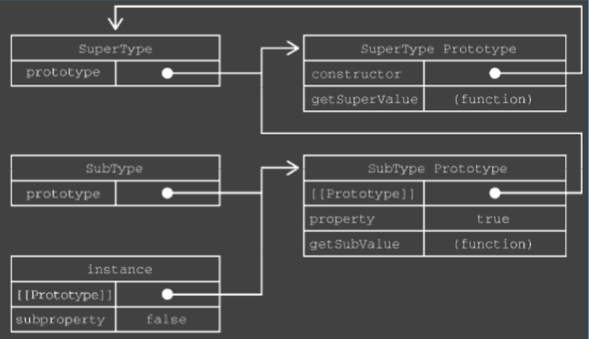
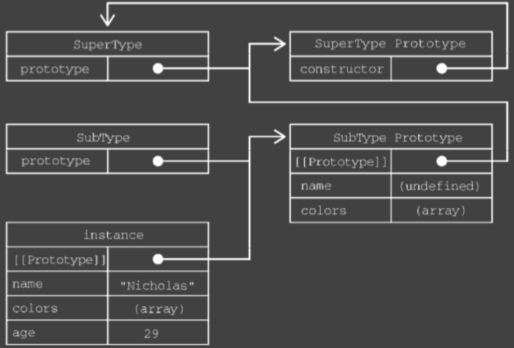

# 实现继承

## 原型等于父实例继承

```js
function SuperType() {
  this.property = true
}

SuperType.prototype.getSuperValue = function(){
  return this.property;
}

function SubType(){
  this.subProperty = false
}
// 继承SuperType
SubType.prototype = new SuperType()
SubType.prototype.getSubValue = function(){
  return this.subProperty
}

let instance = new SubType()
```



构造函数默认有一个prototype属性，执行原型对象。原型对象默认只会获得 constructor 属性, 执行构造函数。

原型继承问题:

```js
function SuperType() {
  this.colors = ['red', 'blue']
}

function SubType(){ }
// 继承SuperType
SubType.prototype = new SuperType()

let instance1 = new SubType()
instance1.colors.push('black')
console.log(instance1.colors) // 'red,blue,black'

let instance2 = new SubType()
console.log(instance1.colors) // 'red,blue,black'
```

1. 包含引用值的问题
2. 子类型实例化的时候不能给付类型的构造函数传参

## 盗用构造函数继承

```js
function SuperType(name) {
  this.name = name
  this.colors = ['red', 'blue']
}

function SubType(){
  // 继承SuperType
  SuperType.call(this, 'Nicholas')
  this.age = 29
}

let instance1 = new SubType()
instance1.colors.push('black')
console.log(instance1.colors) // 'red,blue,black'

let instance2 = new SubType()
console.log(instance1.colors) // 'red,blue'
```

盗用构造函数的问题：

1. 必须在构造函数中定义方法，函数无法重用
2. 无法访问父类原型上的方法

## 组合继承

```js
function SuperType(name) {
  this.name = name
  this.colors = ['red', 'blue']
}

SuperType.prototype.sayName = function(){
  console.log(this.name)
}

function SubType(name, age){
  // 继承属性
  SuperType.call(this, name)
  this.age = age
}

// 继承方法
SubType.prototype = new SuperType()

SubType.prototype.sayAge = function(){
  console.log(this.age)
}

let instance1 = new SubType('Nicholas', 29)
instance1.colors.push('black')
console.log(instance1.colors) // 'red,blue,black'
instance1.sayName() // 'Nicholas'
instance1.sayAge() // 29

let instance2 = new SubType('Greg', 27)
console.log(instance1.colors) // 'red,blue'
instance1.sayName() // 'Nicholas'
instance1.sayAge() // 27
```


调用 SubType 构造函数时,也会调用 SuperType 构造函数,这一次会在新对象上创建实例属性 name 和 colors。这两个实例属性会遮蔽原型上同名的属性。
