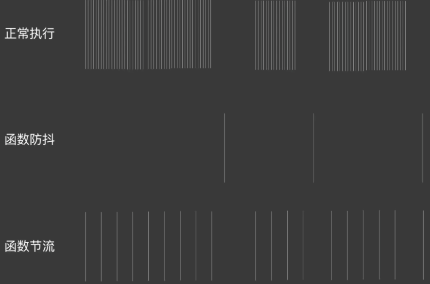

# 防抖、节流


## 防抖

💡 一直触发这个函数，每次触发间隔小于dealy，防抖之后只调用一次

1. 缓存一个定时器id
2. 返回一个实际调用的函数
3. 函数内部判断已经有定时器则清空上次定时器

```jsx
function debounce(fn, dealy = 500) {
	let timer = null
	return function(){
		if(timer) clearTimeout(timer)
		timer = setTimeout(() => {
			fn.apply(this, arguments)
		}, dealy)
	}
}
```
每次是到了dealy最后才执行
```jsx
function testDebounce() {
    console.log('click');
}
// 普通函数包装，返回防抖
let func = debounce(testDebounce, 5000)
document.onclick = () => {
  func();
}
```

## 节流

<aside>
💡 每隔一定间隔调用一次

</aside>

```jsx
function throttle(fn, cycle){
	let start = Date.now()
	let end
	let timer
	return function(){
		if(timer) clearTimeout(timer)
		end = Date.now()
		if(end - start >= cycle){
			fn.apply(this, arguments)
			start = end
		}else{
			timer = setTimeout(() => {
				fn.apply(this, arguments)
			}, cycle)
		}
	}
}
```

简单的节流实现

```jsx
function throttle(fn, delay) {
    let timer;
    return function () {
        if (timer) return
        timer = setTimeout(() => {
            fn.apply(this, arguments);
            timer = null; // 在delay后执行完fn之后清空timer，此时timer为假，throttle触发可以进入计时器
        }, delay)
    }
}
```
存在定时就不建立新定时
```jsx
function throttle(fn, delay) {
    let previous = 0;
    // 使用闭包返回一个函数并且用到闭包函数外面的变量previous
    return function() {
        let now = new Date();
        if(now - previous > delay) {
            fn.apply(this, arguments);
            previous = now;
        }
    }
}
```
第一次执行，在稍后的间隔时间，所有的都不执行