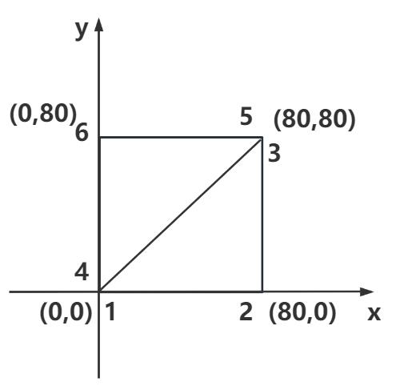

# 缓冲类几何体BufferGeometry

threejs的**长方体BoxGeometry**、**球体SphereGeometry**等几何体都是基于**BufferGeometry类**构建的，BufferGeometry是一个没有任何形状的**空几何体**，你可以通过BufferGeometry自定义任何几何形状，具体一点说就是定义顶点数据。

## 创建空几何体对象

```js
//创建一个空的几何体对象
const geometry = new THREE.BufferGeometry(); 
```

## 定义几何体顶点数据

通过javascript**类型化数组Float32Array**创建一组xyz坐标数据用来表示几何体的顶点坐标。

```js
//类型化数组创建顶点数据
const vertices = new Float32Array([
    0, 0, 0, //顶点1坐标
    50, 0, 0, //顶点2坐标
    0, 100, 0, //顶点3坐标
    0, 0, 10, //顶点4坐标
    0, 0, 100, //顶点5坐标
    50, 0, 10, //顶点6坐标
]);
```

通过threejs的属性缓冲区**对象BufferAttribute**表示threejs几何体顶点数据。

```js
// 创建属性缓冲区对象
//3个为一组，表示一个顶点的xyz坐标
const attribute = new THREE.BufferAttribute(vertices, 3); 
```

## 将顶点数据设置给空几何体

通过geometry.setAttribute设置几何体顶点位置属性的值BufferAttribute

```js
// 设置几何体attributes属性的位置属性
geometry.setAttribute('position', attribute)
```

## 点模型展示自定义几何体

**点模型Points**和**网格模型Mesh**一样，都是threejs的一种模型对象，只是大部分情况下都是用Mesh表示物体。

```js
// 点渲染模式
const material = new THREE.PointsMaterial({
    color: 0xffff00,
    size: 10.0 //点对象像素尺寸
}); 

const points = new THREE.Points(geometry, material); //点模型对象
```
## 线模型展示自定义几何体

下面代码是把几何体作为**线模型Line**的参数，你会发现渲染效果是从第一个点开始到最后一个点，依次连成线。
```js
// 线材质对象
const material = new THREE.LineBasicMaterial({
    color: 0xff0000 //线条颜色
}); 
// 创建线模型对象
const line = new THREE.Line(geometry, material);
```
threejs线模型除了Line，还提供了**LineLoop**、**LineSegments**，区别在于绘制线条的规则：

- LineLoop 是首位相连的闭环线
- LineSegments 是1-2，3-4连接的线段

## 自定义一个矩形几何体

### 网格模型的三角形

**网格模型Mesh**其实就一个一个三角形(面)拼接构成。使用网格模型Mesh渲染几何体geometry，就是几何体*所有顶点坐标三个为一组，构成一个三角形*，多组顶点构成多个三角形，就可以用来模拟表示物体的表面。

网格模型三角形：正反面
- 正面：逆时针

### 矩形平面


每个三角形3个顶点坐标，矩形平面可以拆分为两个三角形，也就是6个顶点坐标。
```js
const vertices = new Float32Array([
    0, 0, 0, //顶点1坐标
    80, 0, 0, //顶点2坐标
    80, 80, 0, //顶点3坐标

    0, 0, 0, //顶点4坐标   和顶点1位置相同
    80, 80, 0, //顶点5坐标  和顶点3位置相同
    0, 80, 0, //顶点6坐标
]);
```
通过定义顶点索引，简化顶点数据（重复的顶点位置坐标删除）
```js
const vertices = new Float32Array([
    0, 0, 0, //顶点1坐标
    80, 0, 0, //顶点2坐标
    80, 80, 0, //顶点3坐标
    0, 80, 0, //顶点4坐标
]);

// Uint16Array类型数组创建顶点索引数据
const indexes = new Uint16Array([
    // 下面索引值对应顶点位置数据中的顶点坐标
    0, 1, 2, 0, 2, 3,
])

// 索引数据赋值给几何体的index属性
geometry.setIndex(new THREE.BufferAttribute(indexes, 1)); //1个为一组
```
通过设置Mesh的wireframe为true可以看到对应的三角抛分。