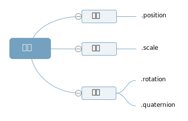

# Mesh模型对象

## 三维向量Vector3

三维向量Vector3有xyz三个分量，可以简单的理解为一个对象。

```js
//new THREE.Vector3()实例化一个三维向量对象
const v3 = new THREE.Vector3(0,0,0);
console.log('v3', v3);
v3.set(10,0,0);//set方法设置向量的值
v3.x = 100;//访问x、y或z属性改变某个分量的值
```


## Mesh模型位置属性

点模型Points、线模型Line、**网格模型Mesh**，这些模型对象的父类都是**Object3D**，所以每个模型都会有从父类继承来的`.position`属性。

position属性又是三维向量，所以可以使用三维向量的操作方法：

```js
// 设置网格模型y坐标
mesh.position.y = 80;

// 设置模型xyz坐标
mesh.position.set(80,2,10);
```

### Mesh平移
执行`.translateX()`、`.translateY()`等方法本质上改变的都是模型的位置属性`.position`

```js
// 等价于 mesh.position.x += 100
mesh.translateX(100)
```

沿自定义方向平移
```js
//向量Vector3对象表示方向
const axis = new THREE.Vector3(1, 1, 1);
axis.normalize(); //向量归一化
//沿着axis轴表示方向平移100
mesh.translateOnAxis(axis, 100);
```
## Mesh缩放

属性.scale表示模型对象的xyz三个方向上的缩放比例，.scale的属性值是一个三维向量对象Vector3,默认值是THREE.Vector3(1.0,1.0,1.0)

```js
// x轴方向放大
mesh.scale.x = 2.0

// 网格模型xyz方向分别缩放
mesh.scale.set(2.0, 1.5, 2.0)
```

## Mesh角度

刚入门，就先给大家介绍比较容易理解的角度属性`.rotation`和对应属性值**欧拉对象Euler**

### 欧拉对象Euler

```js
// 创建一个欧拉对象，表示绕着xyz轴分别旋转45度，0度，90度
const Euler = new THREE.Euler( Math.PI/4,0, Math.PI/2);

// 通过属性设置欧拉对象的三个分量值。
Euler.x = Math.PI/4;
```

### 改变角度属性

角度属性.rotation的值是欧拉对象Euler
```js
//绕y轴的角度设置为60度， 等价于 mesh.rotate(Math.PI/3)
mesh.rotation.y += Math.PI/3;
```

模型执行.rotateX()、.rotateY()等旋转方法，你会发现改变了模型的角度属性.rotation

### 沿自定义方向旋转

```js
const axis = new THREE.Vector3(0,1,0);//向量axis
mesh.rotateOnAxis(axis,Math.PI/8);//绕axis轴旋转π/8
```

