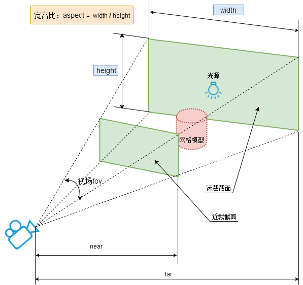

# ThreeJS入门

入门Three.js的第一步，就是认识场景Scene、相机Camera、渲染器Renderer三个基本概念

## 场景Scene
你可以把三维场景Scene (opens new window)对象理解为虚拟的3D场景，用来表示模拟生活中的真实三维场景,或者说三维世界。

```js
// 创建3D场景对象Scene
const scene = new THREE.Scene();
```

### 物体：网格模型Mesh
实际生活中有各种各样的物体，在threejs中可以通过网格模型Mesh (opens new window)表示一个虚拟的物体，比如一个箱子、一个鼠标。

```js
// 两个参数分别为几何体geometry、材质material
const mesh = new THREE.Mesh(geometry, material); //网格模型对象Mesh
```
Mesh模型由两部分组成：几何体geometry, 材质material
#### 物体形状：几何体Geometry
Three.js提供了各种各样的几何体API，用来表示三维物体的几何形状。
比如常见的长方体BoxGeometry，球体SphereGeometry，圆平面CircleGeometry等
```js
//创建一个长方体几何对象Geometry
const geometry = new THREE.BoxGeometry(100, 100, 100); 
```
#### 物体外观：材质Material
如果你想定义物体的外观效果，比如颜色，就需要通过材质Material相关的API实现
```js
//创建一个材质对象Material
const material = new THREE.MeshBasicMaterial({
    color: 0xff0000,//0xff0000设置材质颜色为红色
}); 
```

### 模型位置
通过位置属性.position定义网格模型Mesh在三维场景Scene中的位置，不设置默认是坐标原点。
```js
const mesh = new THREE.Mesh(geometry, material); //网格模型对象Mesh
//设置网格模型在三维空间中的位置坐标，默认是坐标原点
mesh.position.set(0,10,0);
```

### 添加到Scene
把网格模型mesh添加到三维场景scene中。
```js
scene.add(mesh)
```
## 虚拟相机

Threejs提供了**正投影相机OrthographicCamera**和**透视投影相机PerspectiveCamera**
### 透视投影相机PerspectiveCamera
透视投影相机PerspectiveCamera本质上就是在模拟人眼观察这个世界的规律。
```js
// 实例化一个透视投影相机对象
const camera = new THREE.PerspectiveCamera();
```

#### 相机位置
相机对象Camera具有位置属性.position，通过位置属性.position可以设置相机的位置。
```js
//相机在Three.js三维坐标系中的位置
// 根据需要设置相机位置具体值
camera.position.set(200, 200, 200); 
```

#### 相机观察目标
相机镜头对准哪个位置，通过设置`.lookAt()`方法指定一个三维坐标
```js
camera.lookAt(0, 0, 0); //坐标原点

camera.lookAt(mesh.position);//指向mesh对应的位置
```

#### 视锥体
透视投影相机的四个参数fov, aspect, near, far构成一个四棱台3D空间，被称为视锥体，只有视锥体之内的物体，才会渲染出来，视锥体范围之外的物体不会显示在Canvas画布上。



```js
// width和height用来设置Three.js输出的Canvas画布尺寸(像素px)
const width = 800; //宽度
const height = 500; //高度
// 30:视场角度, width / height:Canvas画布宽高比, 1:近裁截面, 3000：远裁截面
const camera = new THREE.PerspectiveCamera(30, width / height, 1, 3000);
```

## WebGL渲染器WebGLRender
通过WebGL渲染器WebGLRenderer可以实例化一个WebGL渲染器对象,渲染器WebGLRenderer执行渲染方法.render()就可以生成一个Canvas画布(照片)，并把三维场景Scene呈现在canvas画布上面。
```js
// 创建渲染器对象
const renderer = new THREE.WebGLRenderer();

renderer.render(scene, camera); //执行渲染操作
```

### 设置Canvas画布尺寸
```js
// 定义threejs输出画布的尺寸(单位:像素px)
const width = 800; //宽度
const height = 500; //高度
renderer.setSize(width, height); //设置three.js渲染区域的尺寸(像素px)
```

### 绘制生成的Canvas画布插入到DOM
渲染器WebGLRenderer通过属性.domElement可以获得渲染方法.render()生成的Canvas画布，.domElement本质上就是一个HTML元素：Canvas画布。
```html
<div id="webgl" style="margin-top: 200px;margin-left: 100px;"></div>
```

```js
document.getElementById('webgl').appendChild(renderer.domElement);
```