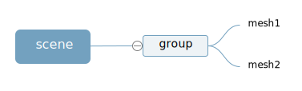

# 层级模型



场景对象是scene是group的父对象，group是mesh1、mesh2的父对象。这样就构成了一个三层的层级结构

```js
//创建两个网格模型mesh1、mesh2
const geometry = new THREE.BoxGeometry(20, 20, 20);
const material = new THREE.MeshLambertMaterial({color: 0x00ffff});
const mesh1 = new THREE.Mesh(geometry, material);
const mesh2 = new THREE.Mesh(geometry, material);
mesh2.translateX(25);

const group = new THREE.Group();
//把mesh1/mesh2插入到组group中，作为group的子对象
group.add(mesh1, mesh2);
//把group插入到场景中作为场景子对象
scene.add(group);
```

Threejs场景对象Scene、组对象Group都有一个子对象属性.children,通过该属性可以访问父对象的子对象，子对象属性.children的值是数组，所有子对象是数组的值

```js
console.log('查看group的子对象',group.children);

// 场景对象结构
console.log('查看Scene的子对象',scene.children);
```

## 父对象旋转

网格模型mesh1、mesh2作为设置为父对象group的子对象，如果父对象group进行旋转、缩放、平移变换，子对象同样跟着变换

```js
//沿着Y轴平移mesh1和mesh2的父对象，mesh1和mesh2跟着平移
group.translateY(100);

//父对象缩放，子对象跟着缩放
group.scale.set(4,4,4);

//父对象旋转，子对象跟着旋转
group.rotateY(Math.PI/6)
```

### 世界坐标vs局部坐标
任何一个模型的**本地坐标(局部坐标)**就是模型的.position属性。

一个模型的**世界坐标**，说的是，模型自身.position和所有父对象.position累加的坐标。

```js
// 声明一个三维向量用来表示某个坐标
const worldPosition = new THREE.Vector3();
// 获取mesh的世界坐标，你会发现mesh的世界坐标受到父对象group的.position影响
mesh.getWorldPosition(worldPosition);
console.log('世界坐标',worldPosition);
console.log('本地坐标',mesh.position);
```

#### 子对象添加一个局部坐标系

```js
//可视化mesh的局部坐标系
const meshAxesHelper = new THREE.AxesHelper(50);
mesh.add(meshAxesHelper);
```

## Object3D替代Group
受threejs历史影响，你会在很多别的代码中看到Object3D作为Group来使用
```js
const mesh1 = new THREE.Mesh(geometry, material);
const mesh2 = new THREE.Mesh(geometry, material);
const obj = new THREE.Object3D();//作为mesh1和mesh2的父对象
obj.add(mesh1,mesh2);
```

## 模型命名

在层级模型中可以给一些模型对象通过.name属性命名进行标记

```js
const group = new THREE.Group();
group.name='小区房子';
const mesh = new THREE.Mesh(geometry, material);
mesh.name='一号楼';

group.add(mesh)
```

Threejs层级模型就是一个树结构，可以通过递归遍历的算法去遍历Threejs一个模型对象包含的所有后代

```js
scene.traverse(function(obj) {
    console.log('所有模型节点的名称',obj.name);
    // obj.isMesh：if判断模型对象obj是不是网格模型'Mesh'
    if (obj.isMesh) {//判断条件也可以是obj.type === 'Mesh'
        obj.material.color.set(0xffff00);
    }
});
```
### 查找模型

Object3D的.getObjectByName()方法查找树结构父元素的某个后代对象

```js
// 返回名.name为"4号楼"对应的对象
const nameNode = scene.getObjectByName ("4号楼");
nameNode.material.color.set(0xff0000);
```

## 模型移除/显隐

.remove()方法和.add()方法是相反的，是把子对象从父对象的.children()属性中删除。
```js
// 删除父对象group的子对象网格模型mesh1
group.remove(mesh1);

scene.remove(ambient, group);//移除场景中环境光
```

模型对象的父类Object3D封装了一个属性.visible，通过该属性可以隐藏或显示一个模型。
```js
mesh.visible =false;// 隐藏一个网格模型，visible的默认值是true
group.visible =false;// 隐藏一个包含多个模型的组对象group

// 隐藏网格模型mesh，visible的默认值是true
mesh.material.visible =false;
// 注意如果mesh2和mesh的.material属性指向同一个材质，mesh2也会跟着mesh隐藏
```
