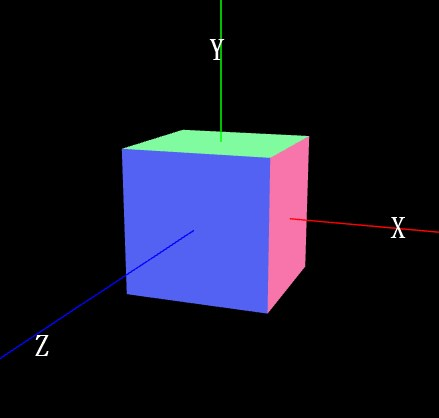
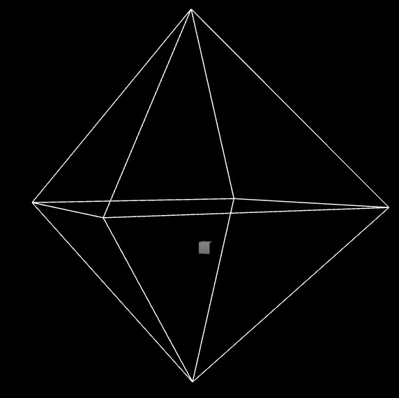

# 开发辅助

## 三维坐标辅助线
THREE.AxesHelper()的参数表示坐标系坐标轴线段尺寸大小
```js
// AxesHelper：辅助观察的坐标系
const axesHelper = new THREE.AxesHelper(150);
scene.add(axesHelper);
```

### xyz轴

three.js坐标轴颜色红R、绿G、蓝B分别对应坐标系的x、y、z轴，对于three.js的3D坐标系默认y轴朝上，如下图所示：



## 点光源辅助

通过点光源辅助观察对象**PointLightHelper**可视化点光源。

```js
// 光源辅助观察
const pointLightHelper = new THREE.PointLightHelper(pointLight, 10);
scene.add(pointLightHelper);
```


## stats查看渲染帧率

```js
//引入性能监视器stats.js
import Stats from 'three/addons/libs/stats.module.js';

//创建stats对象
const stats = new Stats();
//stats.domElement:web页面上输出计算结果,一个div元素，
document.body.appendChild(stats.domElement);
// 渲染函数
function render() {
	//requestAnimationFrame循环调用的函数中调用方法update(),来刷新时间
	stats.update();
	renderer.render(scene, camera); //执行渲染操作
	requestAnimationFrame(render); //请求再次执行渲染函数render，渲染下一帧
}
render();
```

## 网格地面

```js
// 添加一个辅助网格地面
const gridHelper = new THREE.GridHelper(300, 25, 0x004444, 0x004444);
```