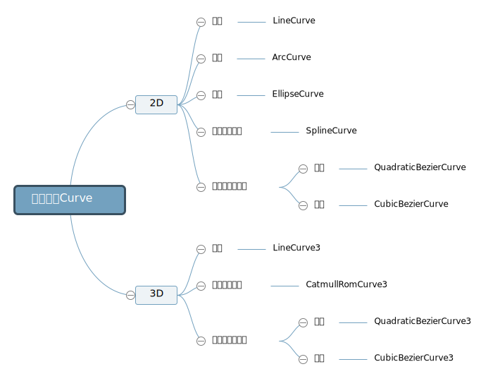
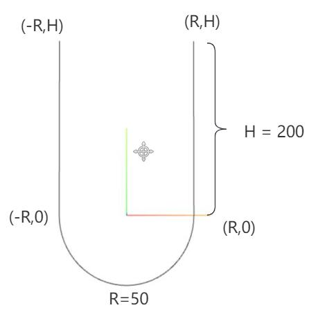
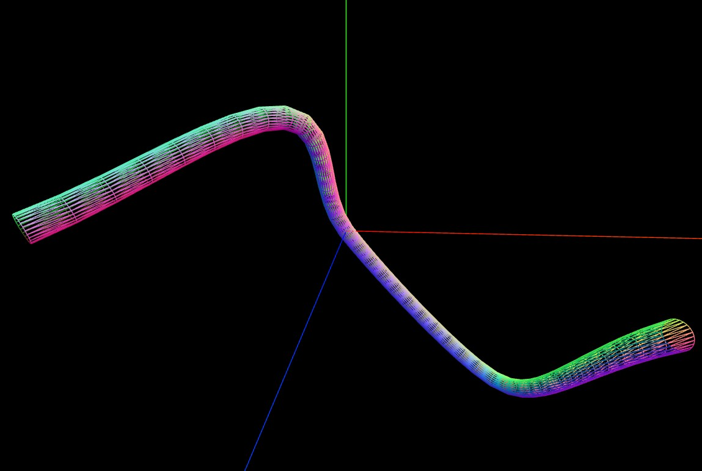

# 曲线Curve

threejs提供了很多常用的曲线或直线API，可以直接使用



## 椭圆EllipseCurve

```js
// 参数1和2表示椭圆中心坐标  参数3和4表示x和y方向半径
const arc = new THREE.EllipseCurve(0, 0, 100, 50);

//getPoints是基类Curve的方法，平面曲线会返回一个vector2对象作为元素组成的数组
const pointsArr = arc.getPoints(50); //分段数50，返回51个顶点

// 数组pointsArr里面的坐标数据提取出来，赋值给geometry.attributes.position属性
const geometry = new THREE.BufferGeometry();
geometry.setFromPoints(pointsArr);
```

通过`.getSpacedPoints()`和`.getPoints()`一样也可以从曲线Curve上返回一系列曲线上的顶点坐标。

通过`.getSpacedPoints()`是按照曲线长度等间距返回顶点数据，`.getPoints(`)获取点的方式并不是按照曲线等间距的方式，而是会考虑曲线斜率变化，斜率变化快的位置返回的顶点更密集。

## CurvePath拼接曲线



```js
const R = 80;//圆弧半径
const H = 200;//直线部分高度
// 直线1
const line1 = new THREE.LineCurve(new THREE.Vector2(R, H), new THREE.Vector2(R, 0));
// 圆弧
const arc = new THREE.ArcCurve(0, 0, R, 0, Math.PI, true);
// 直线2
const line2 = new THREE.LineCurve(new THREE.Vector2(-R, 0), new THREE.Vector2(-R, H));

// CurvePath创建一个组合曲线对象
const CurvePath = new THREE.CurvePath();
//line1, arc, line2拼接出来一个U型轮廓曲线，注意顺序
CurvePath.curves.push(line1, arc, line2);

// 执行.getPoints()，直线部分不会像曲线返回中间多余点，只需要起始点即可。
const pointsArr = CurvePath.getPoints(16); //曲线上获取点
const geometry = new THREE.BufferGeometry();
geometry.setFromPoints(pointsArr); //读取坐标数据赋值给几何体顶点

// 可视化curve.getPoints从曲线上获取的点坐标
const material2 = new THREE.PointsMaterial({
    color: 0xff00ff,
    size: 10,
});
//点模型对象
const points = new THREE.Points(geometry, material2);
```

## 曲线路径管道TubeGeometry



```js
// 三维样条曲线
const path = new THREE.CatmullRomCurve3([
    new THREE.Vector3(-5, 2, 9),
    new THREE.Vector3(-1, 4, 4),
    new THREE.Vector3(0, 0, 0),
    new THREE.Vector3(6, -6, 0),
    new THREE.Vector3(7, 0, 8)
]);

// path:路径   40：沿着轨迹细分数  2：管道半径   25：管道截面圆细分数
const geometry = new THREE.TubeGeometry(path, 40, 0.3, 25);

const material = new THREE.MeshNormalMaterial({
  side: THREE.DoubleSide,
  wireframe: true
});

const mesh = new THREE.Mesh(geometry, material);
```