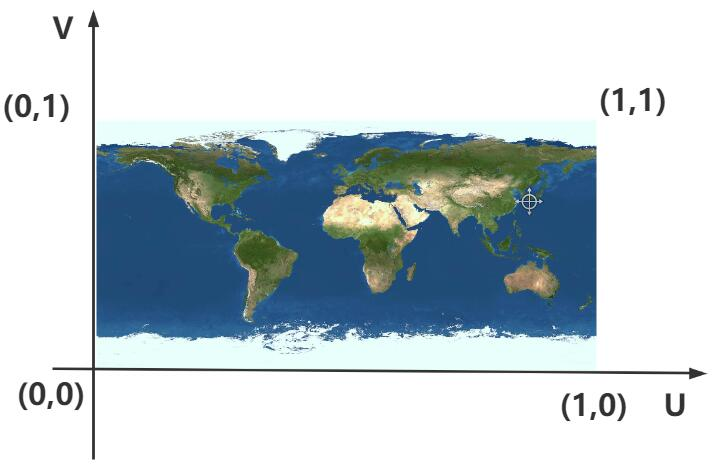

# 纹理贴图

通过纹理贴图加载器TextureLoader的load()方法加载一张图片可以返回一个纹理对象Texture，纹理对象Texture可以作为模型材质颜色贴图.map属性的值

```js
const geometry = new THREE.PlaneGeometry(200, 100); 
//纹理贴图加载器TextureLoader
const texLoader = new THREE.TextureLoader();
// .load()方法加载图像，返回一个纹理对象Texture
const texture = texLoader.load('./earth.jpg');
const material = new THREE.MeshLambertMaterial({
    // 设置纹理贴图：Texture对象作为材质map属性的属性值
    map: texture,//map表示材质的颜色贴图属性
});
```

## UV坐标

### 顶点UV坐标

顶点UV坐标的作用是从纹理贴图上提取像素映射到网格模型Mesh的几何体表面上。

```js
const geometry = new THREE.PlaneGeometry(200, 100); //矩形平面

console.log('uv',geometry.attributes.uv);
```

顶点UV坐标可以在0~1.0之间任意取值，纹理贴图左下角对应的UV坐标是(0,0)，右上角对应的坐标(1,1)



### 自定义UV坐标

UV坐标会对颜色纹理贴图.map进行提取,下面会提取图片的左下角作为贴图

```js
const uvs = new Float32Array([
    0, 0, 
    0.5, 0, 
    0.5, 0.5, 
    0, 0.5, 
]);
geometry.setAttributes('uv', new THREE.BufferAttribute(uvs, 2)) // 2个为一组,表示一个顶点的纹理坐标
```

## 阵列功能

```js
// .load()方法加载图像，返回一个纹理对象Texture
const texture = texLoader.load('./瓷砖.jpg');
// 设置阵列模式
texture.wrapS = THREE.RepeatWrapping;
texture.wrapT = THREE.RepeatWrapping;
// uv两个方向纹理重复数量
texture.repeat.set(12,12);//注意选择合适的阵列数量
```

## 透明PNG贴图

创建一个矩形平面，设置颜色贴图.map,注意选择背景透明的.png图像作为颜色贴图，同时材质设置transparent: true，这样png图片背景完全透明的部分不显示。

```js
// 矩形平面网格模型设置背景透明的png贴图
const geometry = new THREE.PlaneGeometry(60, 60); //默认在XOY平面上
const textureLoader = new THREE.TextureLoader();
const material = new THREE.MeshBasicMaterial({
    map: textureLoader.load('./指南针.png'),        
    transparent: true, //使用背景透明的png贴图，注意开启透明计算
});
const mesh = new THREE.Mesh(geometry, material);
mesh.rotateX(-Math.PI / 2);
```

## 贴图动画

当你通过.offset设置了纹理映射偏移后，是否把.wrapS或.wrapT设置为重复映射模式THREE.RepeatWrapping

```js
texture.offset.x +=0.5;//纹理U方向偏移
// 设置.wrapS也就是U方向，纹理映射模式(包裹模式)
texture.wrapS = THREE.RepeatWrapping;//对应offste.x偏移

// 渲染循环
function render() {
    texture.offset.x +=0.001;//设置纹理动画：偏移量根据纹理和动画需要，设置合适的值
    renderer.render(scene, camera);
    requestAnimationFrame(render);
}
render();
```

