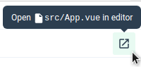

# vue-cli新建项目打不开编辑器

## 开箱即用--打开编辑器

打开编辑器这个功能可以从官网中发现
- Vue CLI 3 在运行 `vue-cli-service serve` 时支持此功能。

## 问题

控制台提示： `File packages/xx/xx/xx.vue opened in editor`

可以发现已经试图去调用文件了，但是打开的文件不存在

需要配置dev-tools，将**允许访问文件网址**打开。

