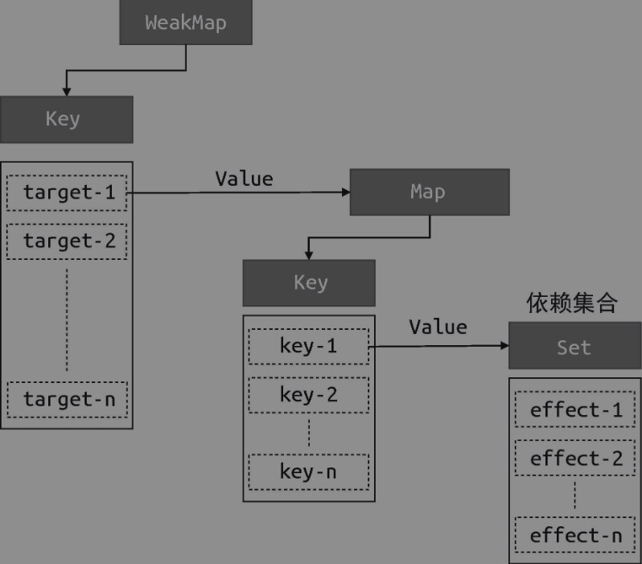

# 响应式数据的基本实现

在ES2015 之前，只能通过 Object.defineProperty 函数实现，这也是 Vue.js 2 所采用的方式。在 ES2015+ 中，我们可以使用代理对象 Proxy 来实现，这也是 Vue.js 3 所采用的方式。
## 简易的Proxy
```js
 // 存储副作用函数的桶
 const bucket = new Set()

 // 原始数据
 const data = { text: 'hello world' }
 // 对原始数据的代理
 const obj = new Proxy(data, {
   // 拦截读取操作
   get(target, key) {
     // 将副作用函数 effect 添加到存储副作用函数的桶中
     bucket.add(activeEffect)
     // 返回属性值
     return target[key]
   },
   // 拦截设置操作
   set(target, key, newVal) {
     // 设置属性值
     target[key] = newVal
     // 把副作用函数从桶里取出并执行
     bucket.forEach(fn => fn())
     // 返回 true 代表设置操作成功
     return true
   }
 })
```
测试数据的拦截以及触发：
```js
 // 用一个全局变量 activeEffect 存储被注册的副作用函数
 let activeEffect
 // effect 函数用于注册副作用函数
 function effect(fn) {
   // 当调用 effect 注册副作用函数时，将副作用函数 fn 赋值给 activeEffect
   activeEffect = fn
   // 执行副作用函数
   fn()
 }
 // 执行副作用函数，触发读取
 effect(() => document.body.innerText = obj.text)
 // 1 秒后修改响应式数据
 setTimeout(() => {
   obj.text = 'hello vue3'
 }, 1000)
```
但是此时如果修改`obj.notExist`的属性值，也会触发副作用的执行，所以需要属性与副作用进行对应

## 副作用与代理对象的对应

分别使用了 WeakMap、Map 和Set：
- WeakMap 由 target --> Map 构成；
- Map 由 key --> Set 构成。



```js
 // 存储副作用函数的桶
 const bucket = new WeakMap()
```

```js
 const obj = new Proxy(data, {
   // 拦截读取操作
   get(target, key) {
     // 将副作用函数 activeEffect 添加到存储副作用函数的桶中
     track(target, key)
     // 返回属性值
     return target[key]
   },
   // 拦截设置操作
   set(target, key, newVal) {
     // 设置属性值
     target[key] = newVal
     // 把副作用函数从桶里取出并执行
     trigger(target, key)
   }
 })

 // 在 get 拦截函数内调用 track 函数追踪变化
 function track(target, key) {
   // 没有 activeEffect，直接 return
   if (!activeEffect) return
   let depsMap = bucket.get(target)
   if (!depsMap) {
     bucket.set(target, (depsMap = new Map()))
   }
   let deps = depsMap.get(key)
   if (!deps) {
     depsMap.set(key, (deps = new Set()))
   }
   deps.add(activeEffect)
 }
 // 在 set 拦截函数内调用 trigger 函数触发变化
 function trigger(target, key) {
   const depsMap = bucket.get(target)
   if (!depsMap) return
   const effects = depsMap.get(key)
   effects && effects.forEach(fn => fn())
 }
```
WeakMap 对 key 是弱引用，不影响垃圾回收器的工作.
例如上面的场景中，如果 target 对象没有任何引用了，说明用户侧不再需要它了，这时垃圾回收器会完成回收任务。