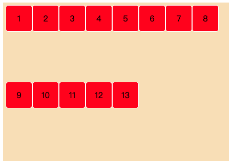
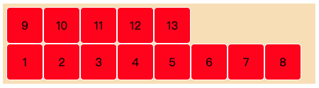

# Flex布局

注意：弹性布局，子元素的 float、clear 和 vertical-align 属性将失效


默认存在两根轴：水平的主轴（main axis）和 垂直的交叉轴（cross axis）

## 容器属性

### 1.flex-direction

主轴的方向

row（默认值）：主轴为水平方向，起点在左端


row-reverse：主轴为水平方向，起点在右端


column：主轴为垂直方向，起点在上沿。


column-reverse：主轴为垂直方向，起点在下沿。


### 2.flex-wrap

1）nowrap（默认）：不换行


2）wrap：换行，第一行在上方


设置容器的高度



3）wrap-reverse：换行，第一行在下方



### 3.flex-flow

flex-flow属性是flex-direction属性和flex-wrap属性的简写形式

```css
.box {
  flex-flow: <flex-direction> || <flex-wrap>
}
```

### 4.justify-content
项目在主轴上的对齐方式

flex-start（默认值）：左对齐


flex-end：右对齐


center: 居中


space-between：两端对齐，项目之间的间隔都相等


space-around：每个项目两侧的间隔相等。所以，项目之间的间隔比项目与边框的间隔大一倍


### 5.align-items
定义项目在交叉轴上如何对齐

flex-start：交叉轴的起点对齐


flex-end：交叉轴的终点对齐


center: 交叉轴的中点对齐


baseline: 项目的第一行文字的基线对齐


stretch（默认值）：如果项目未设置高度或设为auto


设置高度300


### 6.align-content

## 项目的属性

### 1.order
order属性定义项目的排列顺序。数值越小，排列越靠前，默认为0


flex-direction: row;


flex-direction: column;


### 2.flex-grow

flex-grow属性定义项目的放大比例，默认为0，即如果存在剩余空间，也不放大。

所有项目的flex-grow属性都为1，则它们将等分剩余空间（如果有的话）。


一个项目的flex-grow属性为2，其他项目都为1，则前者占据的剩余空间将比其他项多一倍。(具体宽度占比)


### 3.flex-shrink
flex-shrink属性定义了项目的缩小比例，默认为1，即如果空间不足，该项目将缩小。

### 4.flex-basic
flex-basis属性定义了在分配多余空间之前，项目占据的主轴空间（main size）。浏览器根据这个属性，计算主轴是否有多余空间。它的默认值为auto，即项目的本来大小。

### 5.flex
flex属性是flex-grow, flex-shrink 和 flex-basis的简写，默认值为0 1 auto。后两个属性可选。

两个快捷值：auto (1 1 auto) 和 none (0 0 auto)

### 6.align-self
align-self属性允许单个项目有与其他项目不一样的对齐方式，可覆盖align-items属性


默认值为auto，表示继承父元素的align-items属性