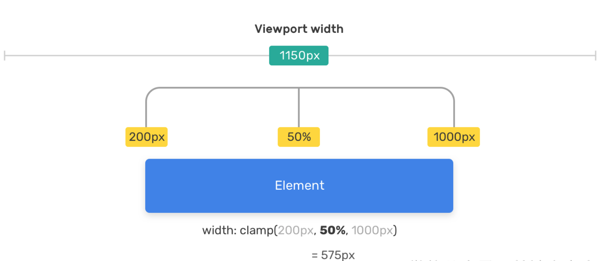

# 数学函数

## calc()

`calc()` 函数用一个表达式作为它的参数，用这个表达式的结果作为值。

```css
.content {
  height: calc(100vh - 60px);
}
```

优点：
可以避免使用 JavaScript 来计算样式的属性值

### 注意事项

- `+` 和 `-` 运算符的两边必须要有空白字符。
- `*` 和 `/` 这两个运算符前后不需要空白字符(推荐加空白)
- 支持嵌套，把被嵌套的 calc() 函数全当成普通的括号。所以，函数内直接用括号就好了。

## clamp()

clamp() 函数接收三个用逗号分隔的表达式作为参数，按最小值、首选值、最大值的顺序排列。
- 当首选值比最小值要小时，则使用最小值。
- 当首选值介于最小值和最大值之间时，用首选值。
- 当首选值比最大值要大时，则使用最大值。

`clamp(MIN, VAL, MAX)` 其实就是表示 `max(MIN, min(VAL, MAX))`
```css
.element {
  width: clamp(200px, 50%, 1000px);
}
```

