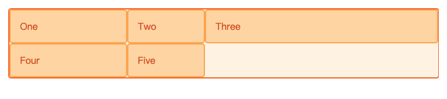
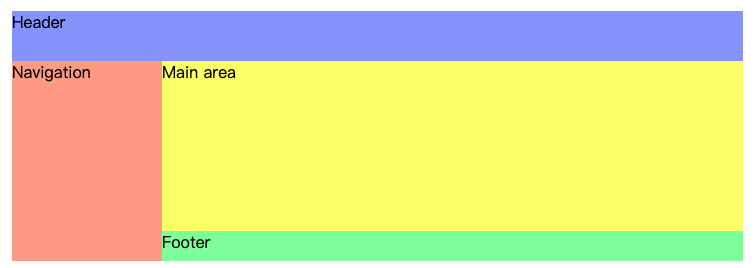

# Grid网格布局

## 网格轨道
它们通过使用属性 `grid-template-columns` 和 `grid-template-rows` 或者简写属性 `grid` 和 `grid-template` 在显式网格中定义。

示例：
```css
.wrapper {
  display: grid;
  grid-template-columns: 200px 1fr 3fr;
}
```
第一列 200px，第二列 1fr，第三列 3fr。网格容器中的可用空间减去 200px 后，剩余空间被分成 4 份，1 份给第二列，3 份给第三列。
```html
<div class="wrapper">
  <div>One</div>
  <div>Two</div>
  <div>Three</div>
  <div>Four</div>
  <div>Five</div>
</div>
```


### 隐式创建轨道大小

隐式网格中创建的轨道默认为自动大小，但可以通过 `grid-auto-rows` 和 `grid-auto-columns` 属性来定义这些轨道的大小。

如果一个表格项目被定位在没有使用 `grid-template-columns` 显式指定尺寸的列中，隐式的 `grid` 轨道就会被创建出来支撑它

## Grid Area

`grid-template-areas` CSS 属性是网格区域 `grid areas` 在 CSS 中的特定命名。

示例：
```css
#page {
  display: grid; /* 1.设置 display 为 grid */
  width: 100%;
  height: 250px;
  grid-template-areas:
    "head head"
    "nav  main"
    "nav  foot"; /* 2.区域划分 当前为 三行 两列 */
  grid-template-rows: 50px 1fr 30px; /* 3.各区域 宽高设置 */
  grid-template-columns: 150px 1fr;
}

#page > header {
  grid-area: head; /* 4. 指定当前元素所在的区域位置，从 grid-template-areas 选取值 */
  background-color: #8ca0ff;
}

#page > nav {
  grid-area: nav;
  background-color: #ffa08c;
}

#page > main {
  grid-area: main;
  background-color: #ffff64;
}

#page > footer {
  grid-area: foot;
  background-color: #8cffa0;
}
```

```html
<section id="page">
  <header>Header</header>
  <nav>Navigation</nav>
  <main>Main area</main>
  <footer>Footer</footer>
</section>
```


### grid-template 简写实现

```css
#page {
  display: grid;
  width: 100%;
  height: 200px;
  grid-template:
    [header-left] "head head" 50px [header-right]
    [main-left] "nav  main" 1fr [main-right]
    [footer-left] "nav  foot" 30px [footer-right]
    / 150px 1fr;
}
```