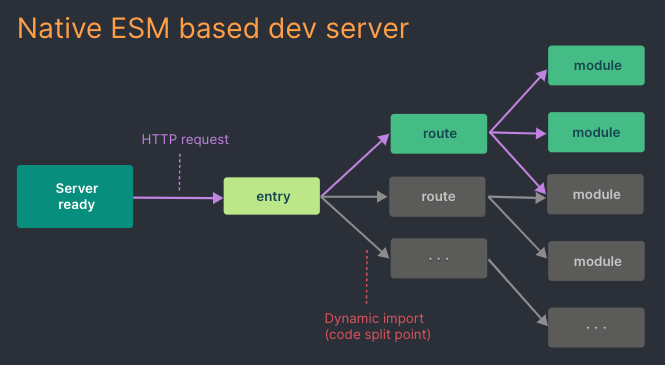

# Vite

## Webpack等工具问题

1. 构建日益膨胀的应用，需要处理的js代码量非常大。基于JS开发的工具开始遇到性能瓶颈
2. 即使使用模块热替换，文件修改的效果也需要几秒钟才能反映出来，降低效率

## Vite的优点

Vite利用浏览器原生开始支持ES模块，并且使用的JS工具很多都是使用编译性语言（Rust，Go等）编写

**webpack**当服务器冷启动的时，基于打包的方式启动，必须优先构建你的整个应用才能提供服务。

### 服务启动方式
Vite通过一开始将应用模块分为**依赖**和**源码**，来改进启动速度

#### 依赖

通过`EsBuild`进行**项目依赖预构建**，将预构建的依赖缓存到`node_modules/.vite`中，已预构建的依赖请求在HTTP头设置`max-age=31536000, immutable`进行强制缓存。

> 预构建可以处理CommonJS和UMD模块的兼容性，统一将依赖转为ES模块；

> 并且将具有许多导出的ESM依赖项（lodash-es）转为单个模块，提升网页的加载性能。

#### 源码

按需加载源码（jsx、css或者.vue文件），这部分经常被编辑，但并不是所有的都需要同时加载，通过让浏览器接管了打包的部分工作：vite只需在浏览器请求源码时进行转换并按需提供源码。

webpack 是先打包再启动开发服务器，vite 是直接启动开发服务器，然后按需编译依赖文件。

由于 vite在启动的时候不需要打包，也就意味着不需要分析模块的依赖、不需要编译，因此启动速度非常快。

### 热更新方面

webpack支持了动态模块替换（HMR）：允许一个模块“热替换”自己，而不影响其它部分。然而在实践中，热更新速度也随着应用规模而显著下降。

Vite中HMR是在原生的ESM上执行，编辑一个文件，会精确的使已编辑的模块失活，无论应用规模都能保持快速热更新。

### 缺点

- **开发环境下首屏加载变慢**：由于 unbundle 机制， Vite 首屏期间需要额外做其它工作。不过首屏性能差只发生在 dev server 启动以后第一次加载页面时发生。之后再 reload 页面时，首屏性能会好很多。原因是 dev server 会将之前已经完成转换的内容缓存起来

- **webpack支持的更广**：由于 Vite 基于ES Module，所以代码中不可以使用CommonJs；webpack更多的关注兼容性, 而 Vite 关注浏览器端的开发体验。