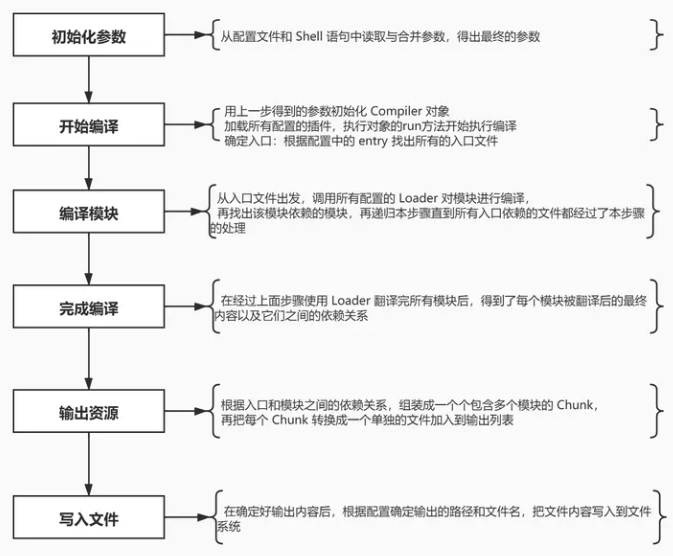

# Webpack

## 核心概念

- 入口(entry)
- 输出(output)
- 解析器（loader）
- 插件(plugin)
- 模式(mode)

## 作用

- **模块打包**，Webpack可以将项目中的各种资源，如JavaScript、CSS、图片、字体等，视作模块，并通过loader将它们转换为合适的格式，最终打包成静态文件
- **编译兼容**，通过loader将浏览器无法直接识别的文件，比如.less,.vue,.jsx这些文件，让开发的时候能使用高效的特性和语法。
- **构建优化**，通过压缩js、CSS、图片等文件，减小文件体积，提升加载性能
- **能力扩展**，通过plugin可以进一步实现按需加载、代码压缩

## Loader作用

让 Webpack 能够去处理那些非 JavaScript 文件

编写Loader时要遵循单一原则，每个Loader只做一种"转义"工作。 每个Loader的拿到的是源文件内容（source），可以通过返回值的方式将处理后的内容输出，也可以调用`this.callback()`方法，将内容返回给webpack。 还可以通过 `this.async()`生成一个`callback`函数，再用这个callback将处理后的内容输出出去。 此外webpack还为开发者准备了开发loader的工具函数集——`loader-utils`。

### 常见Loder

```js
babel-loader：用于将ES6+的新特性转换为ES5语法，以确保代码在各种浏览器中的兼容性。

style-loader 和 css-loader：style-loader用于将CSS代码插入到HTML中的style标签中，而css-loader用于解析CSS文件，处理其中的import和url()等语法。

sass-loader 和 less-loader：用于处理Sass和Less等CSS预处理器，将其转换为普通的CSS代码。

file-loader 和 url-loader：file-loader用于处理文件，将文件复制到输出目录，并返回文件路径，而url-loader可以根据文件大小将文件转换为base64编码或使用file-loader处理。

image-webpack-loader：用于压缩图片文件，减小图片文件的体积，提高页面加载速度。

postcss-loader：用于在CSS中自动添加浏览器前缀，以确保CSS样式在不同浏览器中的兼容性。
```

## Plugin

plugin 会运行在 webpack 的不同阶段，贯穿整个编译周期，目的在于解决 loader 无法实现的其他事。

相对于Loader而言，Plugin的编写就灵活了许多。 webpack在运行的生命周期中会广播出许多事件，Plugin 可以监听这些事件，在合适的时机通过 Webpack 提供的 API 改变输出结果。

### 常见Plugin

```js
HtmlWebpackPlugin：用于生成HTML文件，并自动将打包后的资源文件（如JavaScript、CSS）引入到HTML中，简化了手动管理HTML文件的过程。

MiniCssExtractPlugin：用于将CSS提取为单独的文件，而不是将CSS以style标签的形式插入到HTML中，有助于减小文件体积，提高页面加载速度。

CleanWebpackPlugin：用于在每次构建前清理输出目录，确保每次构建都是从零开始，避免旧文件的干扰。

OptimizeCSSAssetsPlugin：用于优化和压缩CSS代码，减小文件体积，提高页面加载速度。

BundleAnalyzerPlugin：用于分析打包后的文件大小，帮助开发者优化代码和资源，减小文件体积。

SplitChunksPlugin：用于代码分割，将公共模块提取出来，避免重复打包，提高页面加载速度。

CompressionWebpackPlugin：启用gzip，对打包后的文件进行压缩，减小文件体积，加快文件传输速度。

UglifyjsWebpackPlugin: 压缩js
```

## HRM原理

Webpack的热更新原理是通过WebSocket建立服务器和客户端之间的通信，

监视文件变化并重新编译文件，然后将新模块代码发送给客户端，

客户端根据HMR runtime的处理结果来更新页面上的模块，实现模块的热替换。

这样开发者在修改代码时可以实时看到页面的变化，提高了开发效率。


## Webpack的构建流程



以上过程中，Webpack 会在特定的时间点广播出特定的事件，插件在监听到感兴趣的事件后会执行特定的逻辑，并且插件可以调用 Webpack 提供的 API 改变 Webpack 的运行结果