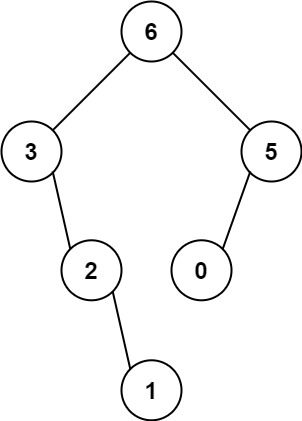

# 最大二叉树
给定一个不含重复元素的整数数组 nums 。一个以此数组直接递归构建的 最大二叉树 定义如下：

二叉树的根是数组 nums 中的最大元素。
左子树是通过数组中 最大值左边部分 递归构造出的最大二叉树。
右子树是通过数组中 最大值右边部分 递归构造出的最大二叉树。
返回有给定数组 nums 构建的 最大二叉树 。



输入：nums = [3,2,1,6,0,5]
输出：[6,3,5,null,2,0,null,null,1]
解释：递归调用如下所示：

- [3,2,1,6,0,5] 中的最大值是 6 ，左边部分是 [3,2,1] ，右边部分是 [0,5] 。
    - [3,2,1] 中的最大值是 3 ，左边部分是 [] ，右边部分是 [2,1] 。
        - 空数组，无子节点。
        - [2,1] 中的最大值是 2 ，左边部分是 [] ，右边部分是 [1] 。
            - 空数组，无子节点。
            - 只有一个元素，所以子节点是一个值为 1 的节点。
    - [0,5] 中的最大值是 5 ，左边部分是 [0] ，右边部分是 [] 。
        - 只有一个元素，所以子节点是一个值为 0 的节点。
        - 空数组，无子节点。

```jsx
/**
 * Definition for a binary tree node.
 * function TreeNode(val, left, right) {
 *     this.val = (val===undefined ? 0 : val)
 *     this.left = (left===undefined ? null : left)
 *     this.right = (right===undefined ? null : right)
 * }
 */
/**
 * @param {number[]} nums
 * @return {TreeNode}
 */
var constructMaximumBinaryTree = function(nums) {
    if(nums.length == 0) return;
    let numMax = -Infinity, indexMax = 0;
    for(let [key, value] of nums.entries()){
        if(value > numMax){
            numMax = value
            indexMax = key
        }
    }

    const left = constructMaximumBinaryTree(nums.slice(0, indexMax))
    const right = constructMaximumBinaryTree(nums.slice(indexMax + 1))
    let root = new TreeNode(numMax, left, right)
    return root
};
```