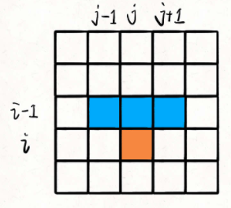

# 下降路径最小和

给你一个 n x n 的 方形 整数数组 matrix ，请你找出并返回通过 matrix 的下降路径 的 最小和 。

下降路径 可以从第一行中的任何元素开始，并从每一行中选择一个元素。在下一行选择的元素和当前行所选元素最多相隔一列（即位于正下方或者沿对角线向左或者向右的第一个元素）。具体来说，位置 (row, col) 的下一个元素应当是 (row + 1, col - 1)、(row + 1, col) 或者 (row + 1, col + 1) 。

```jsx
输入：matrix = [[2,1,3],[6,5,4],[7,8,9]]
输出：13
解释：下面是两条和最小的下降路径，用加粗+斜体标注：
[[2,***1***,3],      [[2,***1***,3],
 [6,***5***,4],       [6,5,***4***],
 [***7***,8,9]]       [7,***8***,9]]
```



**只要知道到达 `(i-1, j), (i-1, j-1), (i-1, j+1)` 这三个位置的最小路径和，加上 `matrix[i][j]` 的值，就能够计算出来到达位置 `(i, j)` 的最小路径和**

```jsx
/**
 * @param {number[][]} matrix
 * @return {number}
 */
var minFallingPathSum = function(matrix) {
    const len = matrix.length
    let memo = {}
    function dp(matrix, i, j){
        if(memo[`${i}_${j}`] !== undefined) return memo[`${i}_${j}`]
        if(i < 0 || j < 0 || i >= len || j >= len) return Number.MAX_SAFE_INTEGER
        if(i === 0) return matrix[0][j]
        memo[`${i}_${j}`] = matrix[i][j] + Math.min(dp(matrix, i-1, j-1), dp(matrix, i-1, j), dp(matrix, i-1, j+1))
        return memo[`${i}_${j}`]
    }
    let result = Number.MAX_SAFE_INTEGER;
    for(let j = 0; j < len; j++){
        result = Math.min(result, dp(matrix, len - 1, j))
    }
    return result
};
```