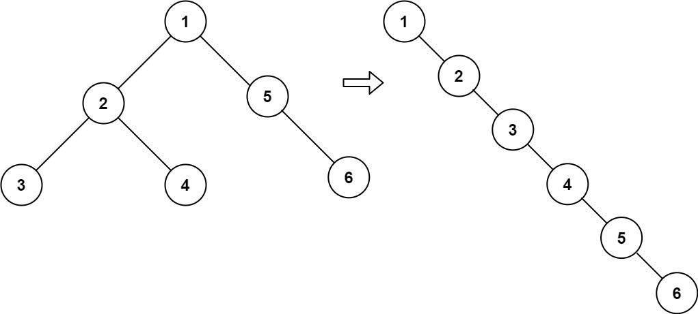
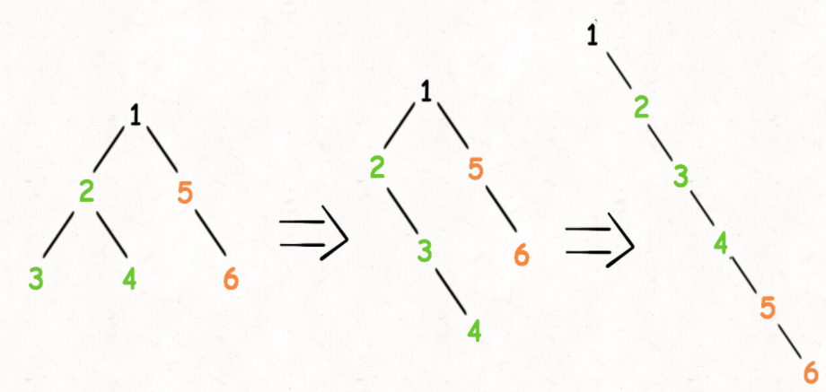

# 二叉树展开为列表

给你二叉树的根结点 root ，请你将它展开为一个单链表：

展开后的单链表应该同样使用 TreeNode ，其中 right 子指针指向链表中下一个结点，而左子指针始终为 null 。
展开后的单链表应该与二叉树 先序遍历 顺序相同。



```
输入：root = [1,2,5,3,4,null,6]
输出：[1,null,2,null,3,null,4,null,5,null,6]
```

将左右子树拉平，然后将原先的右节点挂在末尾



```jsx
/**
 * Definition for a binary tree node.
 * function TreeNode(val, left, right) {
 *     this.val = (val===undefined ? 0 : val)
 *     this.left = (left===undefined ? null : left)
 *     this.right = (right===undefined ? null : right)
 * }
 */
/**
 * @param {TreeNode} root
 * @return {void} Do not return anything, modify root in-place instead.
 */
var flatten = function(root) {
    if(root === null) return;

    flatten(root.left)
    flatten(root.right)

    let temp = root.right //暂存右节点
    root.right = root.left
    root.left = null

    // 3、将原先的右子树接到当前右子树的末端
    let p = root
    while(p.right !== null){
        p = p.right
    }
    p.right = temp
};
```