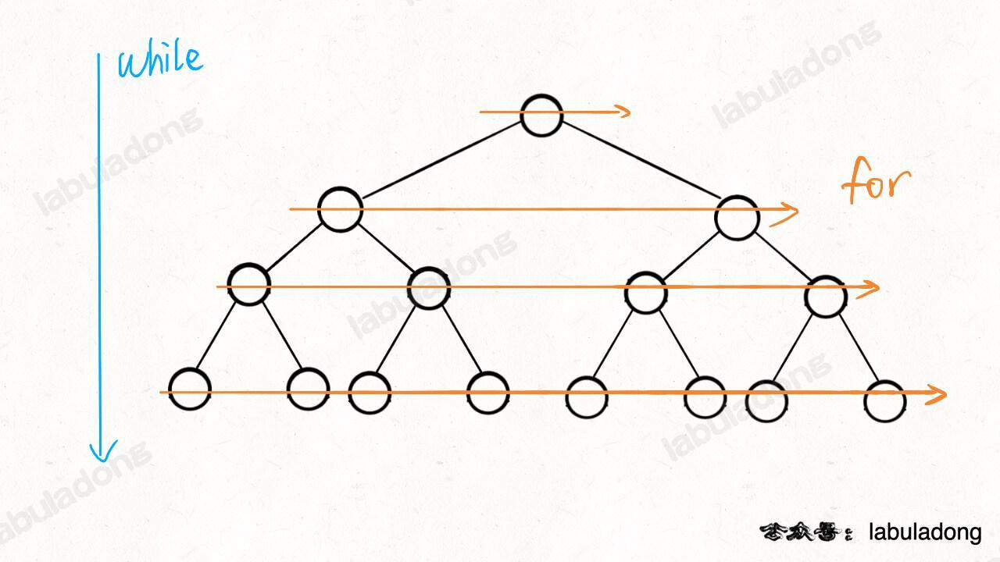

# 二叉树的最小深度

给定一个二叉树，找出其最小深度。

最小深度是从根节点到最近叶子节点的最短路径上的节点数量。

说明：叶子节点是指没有子节点的节点。


```
输入：root = [3,9,20,null,null,15,7]
输出：2
```

## 解法

```js
var minDepth = function(root) {
    if(root.val === null) return 0
    const queue = [root]
    let deep = 1
    while(queue.length > 0){
        for(let i=0;i<queue.length;i++){
            const node = queue.shift()
            if(node.left === null && node.right === null) return deep
            node.left && queue.push(node.left)
            node.right && queue.push(node.right)
        }
        deep++
    }
    return deep
};
```

 `while` 循环和 `for` 循环的配合，`while` 循环控制一层一层往下走，`for` 循环利用 `size` 变量控制从左到右遍历每一层二叉树节点：



上面的解法存在问题，正确解法：

```js
// 注意：javascript 代码由 chatGPT🤖 根据我的 java 代码翻译，旨在帮助不同背景的读者理解算法逻辑。
// 本代码不保证正确性，仅供参考。如有疑惑，可以参照我写的 java 代码对比查看。

/**
* @param {TreeNode} root
* @return {number}
*/
var minDepth = function(root) {
    if(!root){
        return 0;
    }
    let q = [root];
    let depth = 1;
    while (q.length > 0){
        
        let size = q.length;
        /* 将当前队列中的所有节点向四周扩散 */
        for(let i=0;i<size;i++){
            let cur = q.shift();
            /* 判断是否到达终点 */
            if (cur.left === null && cur.right === null) {
                return depth;
            }
            /* 将 cur 的相邻节点加入队列 */
            if (cur.left !== null){
                q.push(cur.left);
            }
            if (cur.right !== null){
                q.push(cur.right);
            }
        }
        /* 这里增加步数 */
        depth++;
    }
    return depth;
}
```