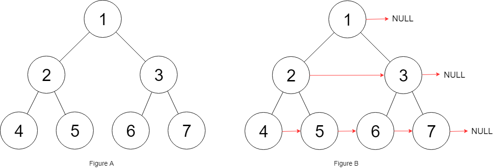

# 二叉树结点指向右侧节点

给定一个 **完美二叉树** ，其所有叶子节点都在同一层，每个父节点都有两个子节点。二叉树定义如下：

```
struct Node {
  int val;
  Node *left;
  Node *right;
  Node *next;
}
```

填充它的每个 next 指针，让这个指针指向其下一个右侧节点。如果找不到下一个右侧节点，则将 next 指针设置为 NULL。

初始状态下，所有 next 指针都被设置为 NULL。



输入：root = [1,2,3,4,5,6,7]
输出：[1,#,2,3,#,4,5,6,7,#]
解释：给定二叉树如图 A 所示，你的函数应该填充它的每个 next 指针，以指向其下一个右侧节点，如图 B 所示。序列化的输出按层序遍历排列，同一层节点由 next 指针连接，'#' 标志着每一层的结束。

```jsx
/**
 * // Definition for a Node.
 * function Node(val, left, right, next) {
 *    this.val = val === undefined ? null : val;
 *    this.left = left === undefined ? null : left;
 *    this.right = right === undefined ? null : right;
 *    this.next = next === undefined ? null : next;
 * };
 */

/**
 * @param {Node} root
 * @return {Node}
 */
var connect = function(root) {
    if(root === null) return null
    connectTwo(root.left, root.right)
    return root
};

var connectTwo = function(left, right){
    if(left === null || right === null) return;

    left.next = right
    connectTwo(left.left, left.right)
    connectTwo(right.left, right.right)
		
		// 跨父节点链接
    connectTwo(left.right, right.left)
}
```