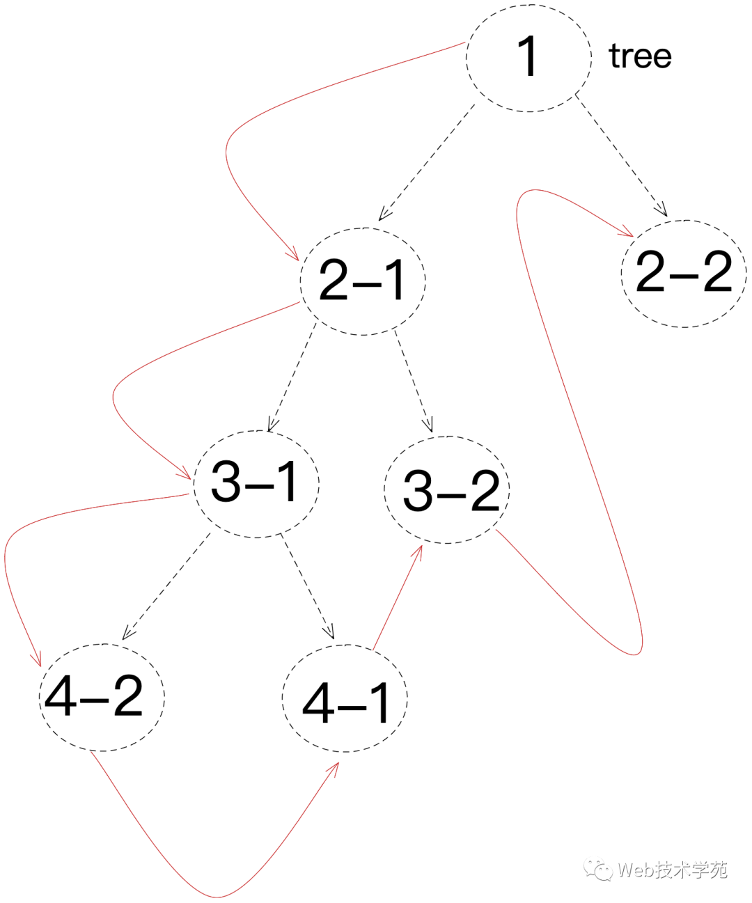
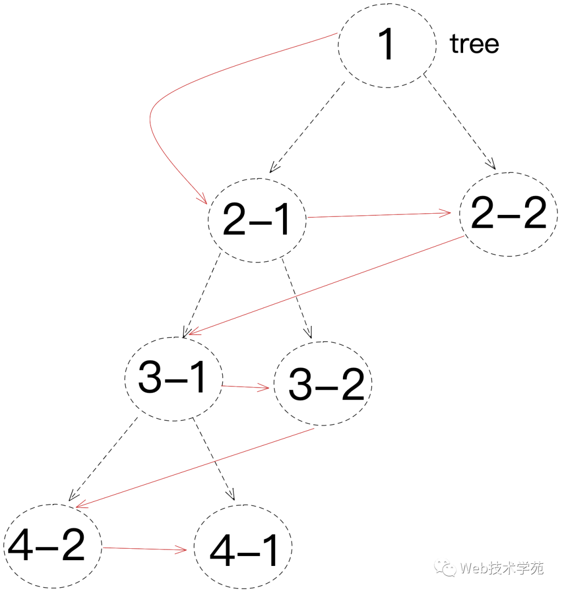

# 深度&广度优先遍历

## 深度优先



深度优先遍历就是当我们搜索一个树的分支时，遇到一个节点，我们会优先遍历它的子节点直到最后根节点为止，最后再遍历兄弟节点，从兄弟子节点寻找它的子节点，直到搜索到最后结果

```js
const deepDFS = (root, nodeList = []) => {
  if(root === null) return
  nodeList.push(root.val)
  if(root.left) deepDFS(root.left, nodeList)
  if(root.right) deepDFS(root.right, nodeList)
  return nodeList
}
```

## 广度优先



从根节点开始，当访问子节点时，先遍历找到兄弟节点，再寻找对应自己的子节点

```js
const deepBFS = (root, nodeList = []) => {
  const queue = [root]
  while(queue.length > 0){
    const node = queue.shift();
    nodeList.push(node.val)
    if(node.left) {
      queue.push(node.left)
    }
  }
}
```
