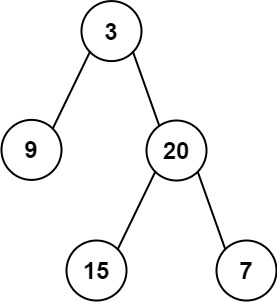
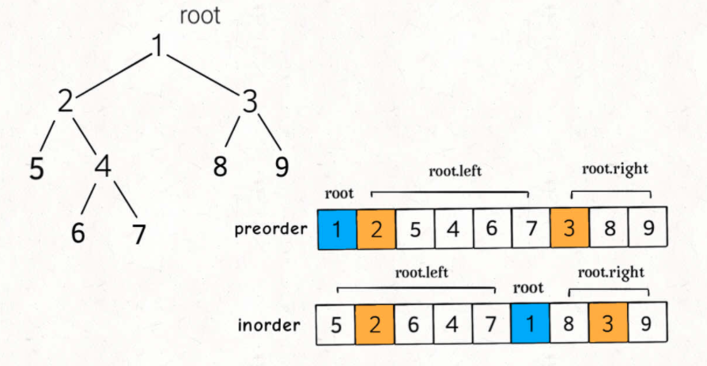

# 通过遍历结果构造二叉树

## 从前序和中序遍历序列构造二叉树 

给定一棵树的前序遍历 `preorder` 与中序遍历 `inorder`。请构造二叉树并返回其根节点。



Input: preorder = [3,9,20,15,7], inorder = [9,3,15,20,7]
Output: [3,9,20,null,null,15,7]



```jsx
/**
 * Definition for a binary tree node.
 * function TreeNode(val, left, right) {
 *     this.val = (val===undefined ? 0 : val)
 *     this.left = (left===undefined ? null : left)
 *     this.right = (right===undefined ? null : right)
 * }
 */
/**
 * @param {number[]} preorder
 * @param {number[]} inorder
 * @return {TreeNode}
 */
var buildTree = function(preorder, inorder) {
    if(preorder.length === 0 || inorder.length === 0) return;
    const value = preorder[0]
    let index = 0
    for(let [k, v] of inorder.entries()){
        if(v === value){
            index = k
            break
        }
    }
    const left = buildTree(preorder.slice(1, 1+index), inorder.slice(0, index))
    const right = buildTree(preorder.slice(1+index), inorder.slice(index + 1))
    return new TreeNode(value, left, right)
};
```

## 从中序与后序遍历序列构造二叉树

```jsx
/**
 * Definition for a binary tree node.
 * function TreeNode(val, left, right) {
 *     this.val = (val===undefined ? 0 : val)
 *     this.left = (left===undefined ? null : left)
 *     this.right = (right===undefined ? null : right)
 * }
 */
/**
 * @param {number[]} inorder
 * @param {number[]} postorder
 * @return {TreeNode}
 */
var buildTree = function(inorder, postorder) {
    if(inorder.length === 0 || postorder.length === 0) return;
    const value = postorder.pop()
    let index = 0
    for(let [k, val] of inorder.entries()){
        if(val === value){
            index = k
            break;
        }
    }
    const left = buildTree(inorder.slice(0, index), postorder.slice(0, index))
    const right = buildTree(inorder.slice(index + 1), postorder.slice(index))
    return new TreeNode(value, left, right)
};
```