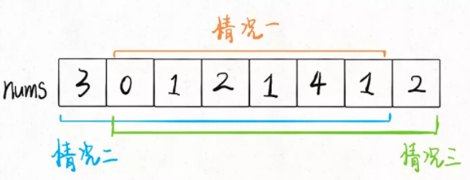

# 打家劫舍1

你是一个专业的小偷，计划偷窃沿街的房屋，每间房内都藏有一定的现金。这个地方所有的房屋都 围成一圈 ，这意味着第一个房屋和最后一个房屋是紧挨着的。同时，相邻的房屋装有相互连通的防盗系统，如果两间相邻的房屋在同一晚上被小偷闯入，系统会自动报警 。

给定一个代表每个房屋存放金额的非负整数数组，计算你 在不触动警报装置的情况下 ，今晚能够偷窃到的最高金额。

```jsx
输入：nums = [2,3,2]
输出：3
解释：你不能先偷窃 1 号房屋（金额 = 2），然后偷窃 3 号房屋（金额 = 2）, 因为他们是相邻的。
```

## 解法：



```jsx
/**
 * @param {number[]} nums
 * @return {number}
 */
var rob = function(nums) {
    function dp(start, end){
        let pre = 0, cur = nums[start]
        for(let i = start+1; i <= end; i++){
            let temp = cur
            cur = Math.max(cur, nums[i]+pre)
            pre = temp
        }
        return cur
    }
    if(nums.length === 1) return nums[0]
    if(nums.length === 2) return Math.max(nums[0], nums[1])
    console.log(dp(0, nums.length-2), dp(1, nums.length-1))
    return Math.max(dp(0, nums.length-2), dp(1, nums.length-1))
};
```

里面计算一定要 i 要从第二个开始计算，如果直接计算好第二个将会有bug