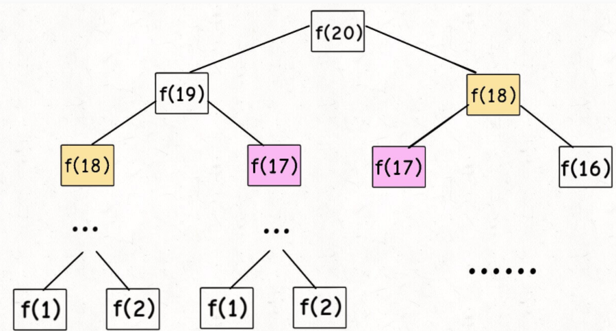
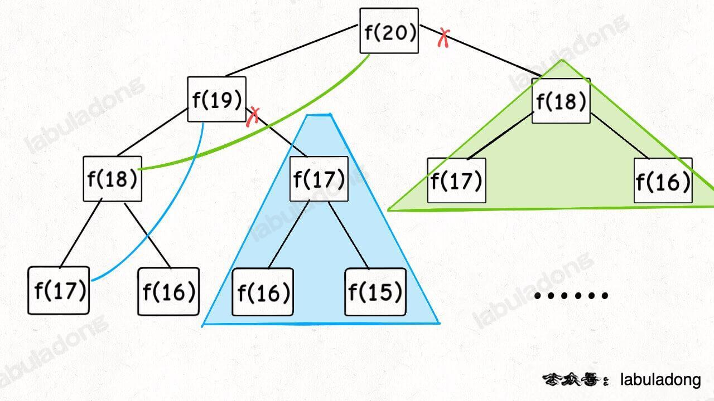
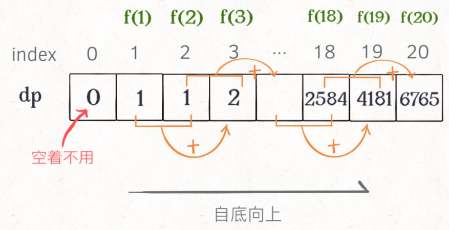

# 斐波那契数

**斐波那契数**，通常用 `F(n)` 表示，形成的序列称为 **斐波那契数列** 。该数列由 `0` 和 `1` 开始，后面的每一项数字都是前面两项数字的和。也就是：

```
F(0) = 0，F(1) = 1
F(n) = F(n - 1) + F(n - 2)，其中 n > 1
```

给你 `n` ，请计算 `F(n)` 。

## 暴力递归



```js
const fib = function(n){
  if(n === 0) return 0
  if(n === 1) return 1
  return fib(n-1) + fib(n-2)
}
```

## 自顶向下

从上向下延伸，都是从一个规模较大的原问题比如说 f(20)，向下逐渐分解规模，直到 f(1) 和 f(2) 这两个 base case，然后逐层返回答案，这就叫「自顶向下」



```jsx
/**
 * @param {number} n
 * @return {number}
 */

let memo = new Map()
var fib = function(n) {
    if(n === 0) return 0
    if(n === 1) return 1
    if(memo.has(n)){
        return memo.get(n)
    }
    const result = fib(n - 1) + fib(n -2)
    memo.set(n, result)
    return result
};
```

## 自底向上

直接从最底下、最简单、问题规模最小、已知结果的 f(1) 和 f(2)（base case）开始往上推，直到推到我们想要的答案 f(20)



```jsx
/**
 * @param {number} n
 * @return {number}
 */
var fib = function(n) {
    const dp = [0, 1]
    for(let i = 2; i <= n; i++){
        dp[i] = dp[i-1] + dp[i-2]
    }
    return dp[n]
};
```


可以考虑状态压缩，只存两个数据

```js
const fib = function(n){
  const dp = [0, 1]
  for(let i = 2; i <= n; i++){
    const temp = dp[0] + dp[1]
    // 滚动更新
    dp[0] = dp[1]
    dp[1] = temp
  }
  return dp[1]
}
```