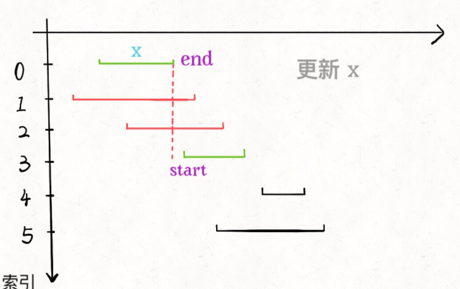

# 无重叠区间

给定一个区间的集合，找到需要移除区间的最小数量，使剩余区间互不重叠。

注意:

可以认为区间的终点总是大于它的起点。
区间 [1,2] 和 [2,3] 的边界相互“接触”，但没有相互重叠。

```jsx
输入: [ [1,2], [2,3], [3,4], [1,3] ]

输出: 1

解释: 移除 [1,3] 后，剩下的区间没有重叠。
```



## 解决思路

- 先按照 `end` 排了序（即按照数组的结尾排序），所以选择 `x` 是很容易的

- 不难发现所有与 `x` 相交的区间必然会与 `x` 的 `end` 相交；
- 如果一个区间不想与 `x` 的 `end` 相交，它的 `start` 必须要大于（或等于）`x` 的 `end`

## 代码实现

```jsx
var eraseOverlapIntervals = function(intervals) {
    let arr = intervals.sort((val1, val2) => val1[1] - val2[1])
    const result = []
    while(arr.length > 0){
        let xArr = arr.shift()
        const temp = [] // 收集所有不与xArr不重叠的数组
        arr.forEach(item => {
            if(item[0] >= xArr[1]){
                temp.push(item)
            }else{
                result.push(item)
            }
        })
        // 将不与xArr不重叠的数组赋值给arr，这里的temp也是有排序的
        arr = temp
    }
    return result.length
};
```