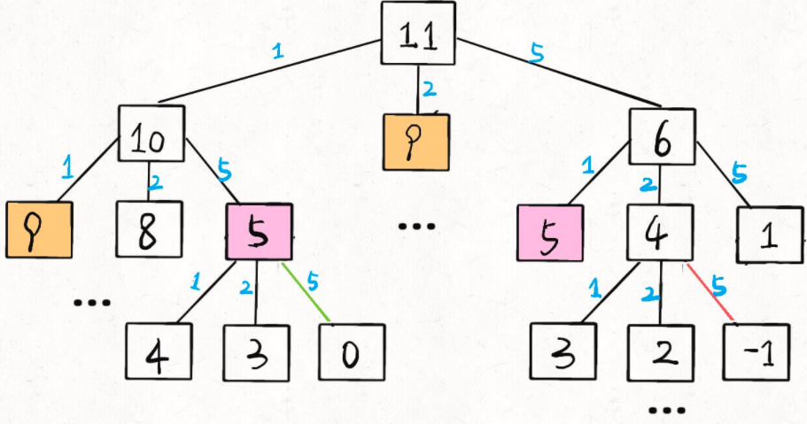

# 零钱问题

给你一个整数数组 coins ，表示不同面额的硬币；以及一个整数 amount ，表示总金额。

计算并返回可以凑成总金额所需的 最少的硬币个数 。如果没有任何一种硬币组合能组成总金额，返回 -1 。

你可以认为每种硬币的数量是无限的。

```
输入：coins =[1, 2, 5], amount =11
输出：3
解释：11 = 5 + 5 + 1
```

## 暴力解决

假设你有面值为 `1, 2, 5` 的硬币，你想求 `amount = 11` 时的最少硬币数（原问题），如果你知道凑出 `amount = 10, 9, 6` 的最少硬币数（子问题），你只需要把子问题的答案加一（再选一枚面值为 1, 2, 5 的硬币），`求个最小值`，就是原问题的答案。

```jsx
/**
 * @param {number[]} coins
 * @param {number} amount
 * @return {number}
 */
function dp(coins, amount){
    if(amount === 0) return 0
    if(amount < 0) return -1
    let result = Number.MAX_SAFE_INTEGER
    for(let coin of coins.values()){
        // 子问题结果
        let subProblem = dp(coins, amount - coin)
        // 子问题无解
        if(subProblem === -1) continue
        // 子问题+1就是结果
        result = Math.min(result, subProblem + 1)
    }
    return result === Number.MAX_SAFE_INTEGER ? -1 : result
}
```

## 增加备忘录
解决重复问题，大大减小子问题数目



```jsx
/**
 * @param {number[]} coins
 * @param {number} amount
 * @return {number}
 */
let memo = {}
function dp(coins, amount){
    if(amount === 0) return 0
    if(amount < 0) return -1
    // 查询备忘录
    if(memo[amount] !== undefined) return memo[amount]
    let result = Number.MAX_SAFE_INTEGER
    for(let coin of coins.values()){
        let subProblem = dp(coins, amount - coin)
        if(subProblem === -1) continue
        result = Math.min(result, subProblem + 1)
    }
    result === Number.MAX_SAFE_INTEGER ? -1 : result
    // 存储备忘录
    memo[amount] = result
    return result
}
```

## 自底向上迭代解法

```js
var coinChange = function(coins, amount) {
    var dp = new Array(amount + 1).fill(amount + 1);
     // The size of the array is amount + 1, and the initial value is also amount + 1
    //  dp[i] represents the minimum number of coins needed for the amount i
    dp[0] = 0;
    // The outer loop is traversing all the values of all states
    for (var i = 0; i < dp.length; i++) {
        // The inner loop is to find the minimum value of all choices
        for (var coin of coins) {
            // Sub-problems are unsolvable, skip
            if (i - coin < 0) {
                continue;
            }
            dp[i] = Math.min(dp[i], 1 + dp[i - coin]);

        }
    }
    return (dp[amount] == amount + 1) ? -1 : dp[amount];
};
```