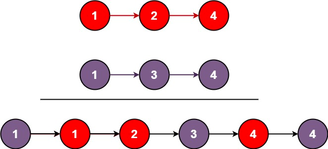

# 合并两个有序链表

将两个升序链表合并为一个新的 **升序** 链表并返回。新链表是通过拼接给定的两个链表的所有节点组成的。



```
输入：l1 = [1,2,4], l2 = [1,3,4]
输出：[1,1,2,3,4,4]
```
列表节点
```javascript
/**
 * Definition for singly-linked list.
 * function ListNode(val, next) {
 *     this.val = (val===undefined ? 0 : val)
 *     this.next = (next===undefined ? null : next)
 * }
 */
```

## 代码实现

```javascript
/**
 * @param {ListNode} list1
 * @param {ListNode} list2
 * @return {ListNode}
 */
var mergeTwoLists = function(list1, list2) {
    function traverse(list1, list2){
        if(list1 === null) return list2
        if(list2 === null) return list1
        let list;          // 定义一个节点，将较小值赋给此节点
        if(list1.val < list2.val){
            list = list1
            list.next = traverse(list1.next, list2) // 将赋值后的节点的下个节点，和未赋值的节点放入递归
        }else{
            list = list2
            list.next = traverse(list1, list2.next)
        }
        return list
    }
    return traverse(list1, list2)
};
```

## 虚拟头节点

```jsx
/**
 * @param {ListNode} list1
 * @param {ListNode} list2
 * @return {ListNode}
 */
var mergeTwoLists = function(list1, list2) {
    let head = new ListNode() // 设计一个虚拟的头节点，返回的时候将头节点的next返回即可
    let p1 = list1, p2 = list2, p = head
    while(p1 !== null && p2 !== null){
        if(p1.val < p2.val){
            p.next = p1
            p1 = p1.next
        }else{
            p.next = p2
            p2 = p2.next
        }
        p = p.next
    }
    if(p1 === null) p.next = p2
    if(p2 === null) p.next = p1
    return head.next
};
```