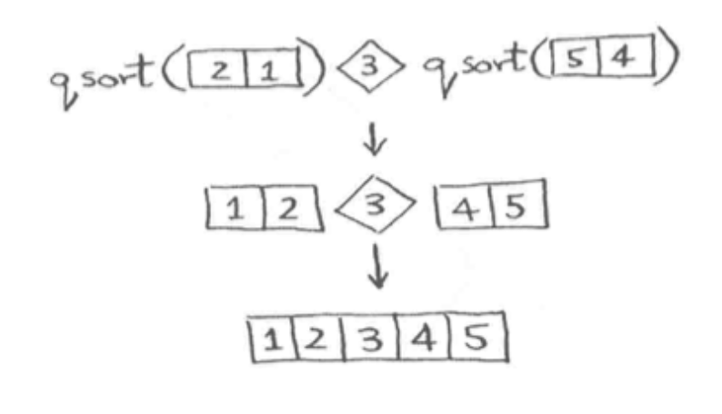

# 基础排序

## 冒泡排序
将每次的最大值通过比对，换位置逐步放到最后面

```jsx
function sort(nums) {
	for(let i = nums.length - 1; i >= 0; i--){
		for(let j = 1; j <= i; j++){
			if(nums[j-1] > nums[j]) [nums[j-1], nums[j]] = [nums[j], nums[j-1]]
		}
	}
	return nums
}
```

## 选择排序

```tsx
function selectSort(arr){
    const result = []
    let len = arr.length
    for(let i = 0; i< len; i++){
        const item = getLarge(arr)
        // arr = arr.filter(it => item !== it)
        const index = arr.findIndex(s => s == item)
        // arr.indexOf(item)
        arr.splice(index, 1)
        result.push(item)
    }
    return result
}
function getLarge(arr){
    let large = arr[0]
    for(let i = 0; i < arr.length; i++){
        if(large < arr[i]) large = arr[i]
    }
    return large
}
```

### Array.prototype.findIndex()

**`findIndex()`**方法返回数组中满足提供的测试函数的第一个元素的**索引**。若没有找到对应元素则返回-1。

## 插入排序

```js
function insert(arr) {
	for(let i = 1; i< arr.length; i++){
		for(let j = i-1; j >= 0 && arr[j] > arr[j+1]; j++ ){
			[arr[j], arr[j+1]] = [arr[j+1], arr[j]]
		}
	}
}
```
已经排好序的最后一位和需要插入的那个做比较

## 快速排序

### 实现思路

- 基线条件——为空或只包含一个元素，就不需要排序
- 使用分治让其满足基线条件，取一个基准值将数组分为三部分，对两边数组继续治理

### 举例说明



### 代码实现

```javascript
function quickSort(arr){
    if(arr.length < 2){
        return arr
    }else{
        const pivot = arr[0]
        const prv = [];
        const next = [];
        for(let i = 1; i < arr.length; i++){
            if(arr[i] < pivot){
                prv.push(arr[i])
            }else{
                next.push(arr[i])
            }
        }
        return quickSort(prv).concat(pivot, quickSort(next))
    }
}
```