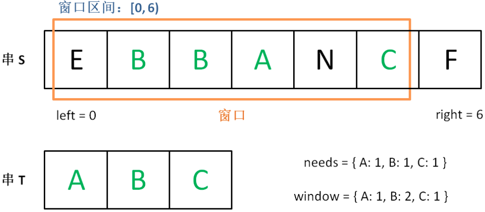

# 最小覆盖子串

给你一个字符串 s 、一个字符串 t 。返回 s 中涵盖 t 所有字符的最小子串。如果 s 中不存在涵盖 t 所有字符的子串，则返回空字符串 "" 。

注意：

- 对于 t 中重复字符，我们寻找的子字符串中该字符数量必须不少于 t 中该字符数量。
- 如果 s 中存在这样的子串，我们保证它是唯一的答案。

```jsx
输入：s = "ADOBECODEBANC", t = "ABC"
输出："BANC"
```



## 思路分析

1. 使用need对象统计t中字符的各类型的个数，window统计滑动窗口的各字符的个数
2. 左右指针开始的时候都指向第一个字符，之后右指针不断向前，如果字符是需要的字符，则让滑动窗口的统计值加一，要是和需要的数量相同了，就说明此字符找全了（有效值）
3. 当滑动窗口中有效值数量和need的Key的数量相等，则滑动左指针尝试缩小窗口
4. 备份左指针的值，获取这个值看是否是need中的值，如果是，先判断判断是否数量与need统计的数量相等，决定是否有效值减一，之后再修改滑动窗口的统计值

## 代码实现
```js
/**
 * @param {string} s
 * @param {string} t
 * @return {string}
 */
var minWindow = function (s, t) {
    let need = {};//需要覆盖的字符串频数
    let window = {};//滑动窗口的字符串频数
    //统计t中字符频数
    for (let a of t) {
        need[a] = (need[a] || 0) + 1;
    }

    //左右指针
    let left = 0,
        right = 0;
    let valid = 0; //滑动窗口中能覆盖的字符种类数
    let start = 0,//最小覆盖子串的起始索
        len = Number.MAX_VALUE;//最小覆盖子串长度
    while (right < s.length) {
        //进入滑动窗口右边的字符
        let c = s[right];
        right++;//右移窗口
        //如果当前字符在need字符中 更新window中字符数
        if (need[c]) {
            window[c] = (window[c] || 0) + 1;
            //如果当前窗口和需要的字符数量一致时，字符种类+1
            if (window[c] == need[c]) {
                valid++;
            }
        }

        //字符种类与需要的字符个数一致时，就收缩窗口
        while (valid == Object.keys(need).length) {
            //当前窗口长度小于之前窗口的长度len 更新最小覆盖子串的起始位置和长度
            if (right - left < len) {
                start = left;
                len = right - left;
            }
            let d = s[left];//需要被移除的字符
            left++;//左移窗口 从窗口中移除字符
            //如果在需要的字符中 更新window中字符数
            if (need[d]) {
                //如果当前窗口和需要的字符数量一致时，字符种类-1
                if (window[d] == need[d]) {
                    valid--;
                }
                window[d]--;
            }
        }
    }
    //没有找到覆盖子串 返回'' 否则返回覆盖子串
    return len == Number.MAX_VALUE ? "" : s.substr(start, len);
};
```