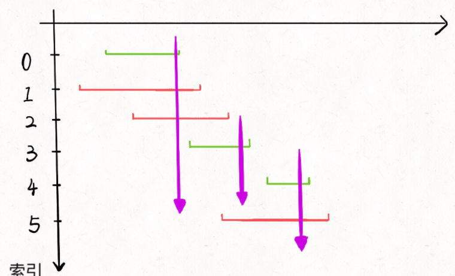

# 最少数量的箭引爆气球
在二维空间中有许多球形的气球。对于每个气球，提供的输入是水平方向上，气球直径的开始和结束坐标。由于它是水平的，所以纵坐标并不重要，因此只要知道开始和结束的横坐标就足够了。开始坐标总是小于结束坐标。

一支弓箭可以沿着 x 轴从不同点完全垂直地射出。在坐标 x 处射出一支箭，若有一个气球的直径的开始和结束坐标为 xstart，xend， 且满足  xstart ≤ x ≤ xend，则该气球会被引爆。可以射出的弓箭的数量没有限制。 弓箭一旦被射出之后，可以无限地前进。我们想找到使得所有气球全部被引爆，所需的弓箭的最小数量。

给你一个数组 points ，其中 points [i] = [xstart,xend] ，返回引爆所有气球所必须射出的最小弓箭数。

```jsx
输入：points = [[10,16],[2,8],[1,6],[7,12]]
输出：2
解释：对于该样例，x = 6 可以射爆 [2,8],[1,6] 两个气球，以及 x = 11 射爆另外两个气球
```



```jsx
/**
 * @param {number[][]} points
 * @return {number}
 */
var findMinArrowShots = function(points) {
    let arr = points.sort((val1, val2) => val1[1] - val2[1])
    let result = 0
    while(arr.length > 0){
        result++
        let point = arr.shift()
        arr = arr.filter(item => item[0] > point[1])
    }
    return result
};
```