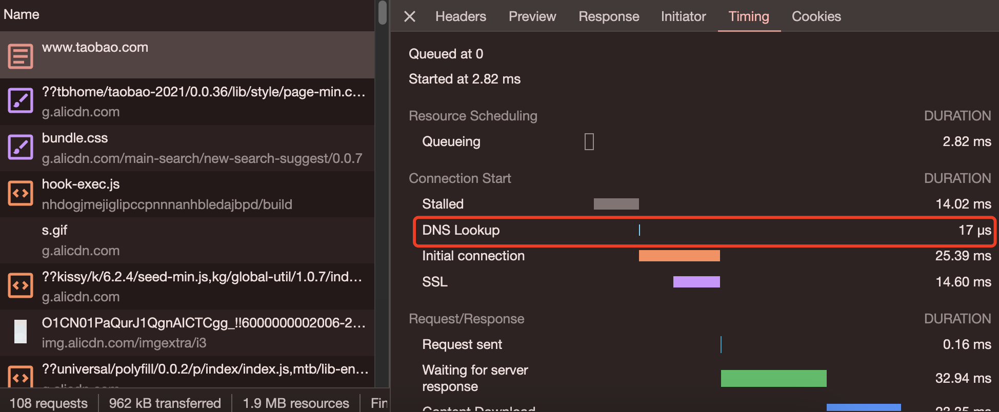

# DNS优化

浏览器从服务器获取资源，必须先将改域名解析为IP地址，然后才能发出请求。此过程就是DNS解析。

一次DNS解析一般需要花费几号秒到几十毫秒，当网站所使用的资源在多个不同的域名下，时间将会成倍的增加，从而增加网站的加载时间。

## 减少DNS的请求次数

### 清DNS缓存

清空浏览器缓存
```js
// 清dns缓存
chrome://net-internals/#dns
// 清除套接字缓存
chrome://net-internals/#sockets
```

清系统DNS缓存
```shell
# win 查看DNS缓存记录
ipconfig /displaydns

# win 清DNS缓存
ipconfig /flushdns

# mac 清DNS缓存
sudo killall -HUP mDNSResponder
```

通过上面清空dns的缓存，我们就可以通过浏览器面板找到dns解析的耗时：


## DNS 预获取：DNS Prefetch

```html
<link rel="dns-prefetch" href="//g.alicdn.com">
```

## 其他的优化手段

- 延长DNS缓存时间
- 使用CDN加速域名，比如各大云厂商提供的加速域名