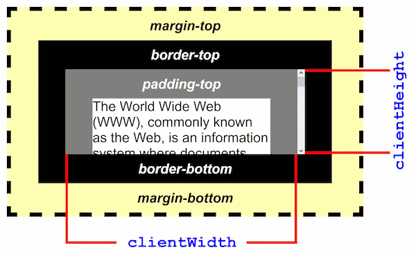
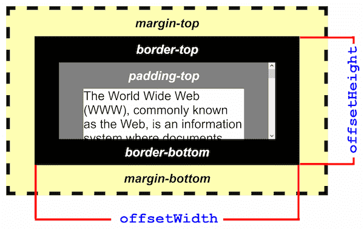

# DOM元素宽度

## clientWidth

该属性**包括**内边距（padding），但**不包括**边框（border）、外边距（margin）和垂直滚动条（如果存在）

## offsetWidth(border-box非常相似)

`offsetWidth` 是测量**包含**元素的边框 (border)、水平线上的内边距 (padding)、竖直方向滚动条 (scrollbar)（如果存在的话）、以及 CSS 设置的宽度 (width) 的值

`box-sizing:border` 的时候 `offsetWidth` 其实就等于 `dom 元素的 width`

## scrollWidth

这个只读属性是元素内容宽度的一种度量，包括由于 `overflow` 溢出而在屏幕上不可见的内容。

宽度的测量方式与clientWidth相同：它**包含**元素的内边距，但**不包括**边框，外边距或垂直滚动条（如果存在）。它还可以包括伪元素的宽度，例如::before或::after。

如果元素的内容可以适合而**不需要水平滚动条**，则其`scrollWidth` == `clientWidth`