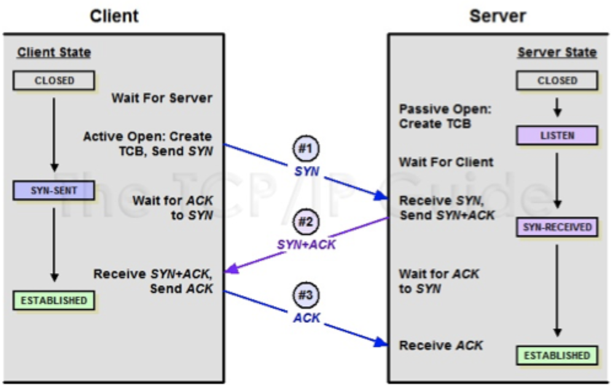
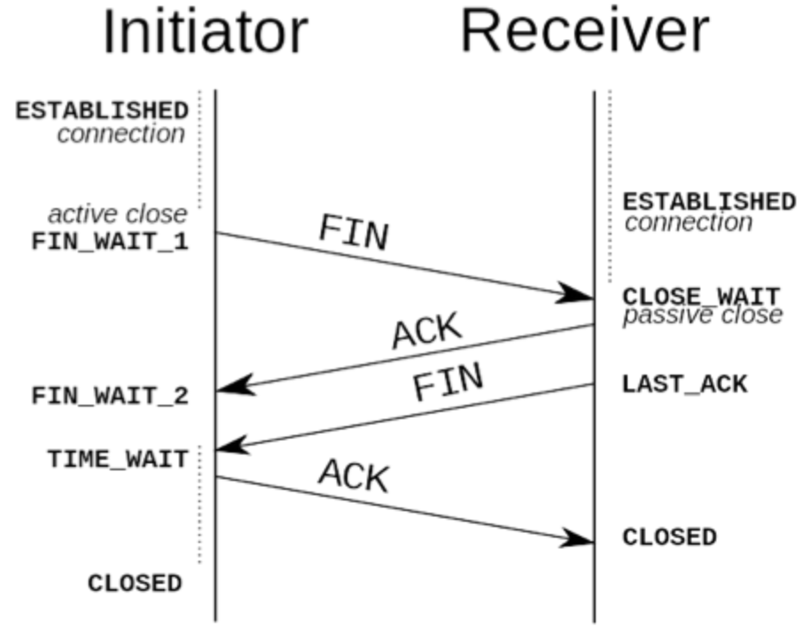

# 网络协议

## UDP协议

- 协议开销小、效率高。
- UDP是**无连接**的,即发送数据之前不需要建立连接。
- UDP使用尽最大努力交付,即不**保证可靠**交付。
- UDP**没有拥塞控制**。
- UDP支持一对一、一对多、多对一和多对多交互通信。
- UDP的首部开销小,只有8个字节

## TCP协议

### 三次握手

### 四次挥手

### 为什么连接需要三次，关闭却需要四次？

因为当Server端收到Client端的SYN连接请求报文后，可以直接发送SYN+ACK报文。其中ACK报文是用来应答的，SYN报文是用来同步的。

但是关闭连接时，当Server端收到FIN报文时，很可能并不会立即关闭SOCKET，所以只能先回复一个ACK报文，告诉Client端，“你发的FIN报文我收到了”。只有等到我Server端所有的报文都发送完了，我才能发送FIN报文，因此不能一起发送。故需要四步握手。

### 挥手的时候TIME_WAIT状态需要等待一段时间才能返回CLOSE状态

虽然按道理，四个报文都发送完毕，我们可以直接进入CLOSE状态了，但是我们必须假象网络是不可靠的，有可以最后一个ACK丢失。所以TIME_WAIT状态就是用来重发可能丢失的ACK报文。

Server如果没有收到ACK，将不断重复发送FIN片段。所以Client不能立即关闭，它必须确认Server接收到了该ACK。

### 为什么握手不能是两次？

三次握手是为了确保双方都能发送和接受数据，建立起可靠的通信通道。

两次握手情况下，**客户端发送连接请求给服务端**被滞留的话，服务端不能及时响应，客户端会误认为连接建立成功，实际服务端并没有收到连接请求。

两次握手情况下，如果**服务端发送确认给客户端**被滞留，客户端没收到确认，客户端不知道服务端的情况是否收到连接请求，将忽略服务端返回的任何数据

### 建立连接，客户端出故障怎么办？

TCP还设有一个保活计时器，显然，客户端如果出现故障，服务器不能一直等下去，白白浪费资源。

服务器每收到一次客户端的请求后都会重新复位这个计时器，时间通常是设置为2小时，若两小时还没有收到客户端的任何数据，服务器就会间隔一段时间发送发送一个探测报文段，连续10次如果没响应，就认为是客户端故障了，直接关闭连接

## Websocket

websocket是html5新增的全双工通讯协议，基于Tcp协议，属于应用层协议浏览器和服务器只需要一次握手就可以创建持久性的连接，并进行双向数据传输，也是解决了半双工通讯协议的弊端。

### 协议特点

1. 支持**双向通信**，实时性更强
2. 可以发送文本，也可以发送**二进制数据**
3. 建立在Tcp协议之上，服务端的实现比较容易
4. 数据格式比较轻量，**性能消耗小**，通讯高效
5. 没有**同源策略限制**，客户端可以和任何服务端通信
6. 协议标识符是ws,如果加密为wss。服务器的网址就是URL
7. 与http协议有良好的兼容性，默认端口也是80和443，并且握手阶段还是用的http协议，因此握手时不会被屏蔽，能通过各种http代理服务器。

### 使用场景

1. 弹幕
2. 协同编辑
3. 股票价格实时更新

## HTTP 2.0

1. **多路复用**，HTTP 1.x 限制了同一个域名下的请求数量。多路复用同一个TCP连接，当页面中需要请求众多资源的时候队头不会阻塞，提高传输效率

2. **二进制分帧**，将传输的数据分割为更小的消息，采用二进制格式编码传输

3. **头部压缩**，使用HPACK算法对传输的header进行编码，减少了header的体积

4. **服务端推送**， 服务器可以在客户端请求之前将资源推送给客户端，减少了客户端请求的次数，提高了加载速度。

5. **优化加密协议，提高了安全性**