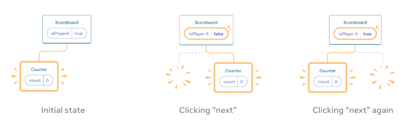

# 相同位置重置state

## 问题

```jsx

import { useState } from 'react';

export default function Scoreboard() {
  const [isPlayerA, setIsPlayerA] = useState(true);
  return (
    <div>
      {isPlayerA ? (
        <Counter person="Taylor" />
      ) : (
        <Counter person="Sarah" />
      )}
      <button onClick={() => {
        setIsPlayerA(!isPlayerA);
      }}>
        下一位玩家！
      </button>
    </div>
  );
}

function Counter({ person }) {
  const [score, setScore] = useState(0);
  const [hover, setHover] = useState(false);

  let className = 'counter';
  if (hover) {
    className += ' hover';
  }

  return (
    <div
      className={className}
      onPointerEnter={() => setHover(true)}
      onPointerLeave={() => setHover(false)}
    >
      <h1>{person} 的分数：{score}</h1>
      <button onClick={() => setScore(score + 1)}>
        加一
      </button>
    </div>
  );
}
```
这两个 `Counter` 出现在相同的位置，所以 React 会认为它们是 同一个 `Counter`，只是传了不同的 `person prop`
```js
{isPlayerA ? (
  <Counter person="Taylor" />
) : (
  <Counter person="Sarah" />
)}
```

## 方法一：将组件渲染在不同的位置 

```js
{isPlayerA &&
  <Counter person="Taylor" />
}
{!isPlayerA &&
  <Counter person="Sarah" />
}
```


## 方法二：使用 key 来重置 state

使用 `key` 来让 React 区分任何组件

```js
{isPlayerA ? (
  <Counter key="Taylor" person="Taylor" />
) : (
  <Counter key="Sarah" person="Sarah" />
)}
```